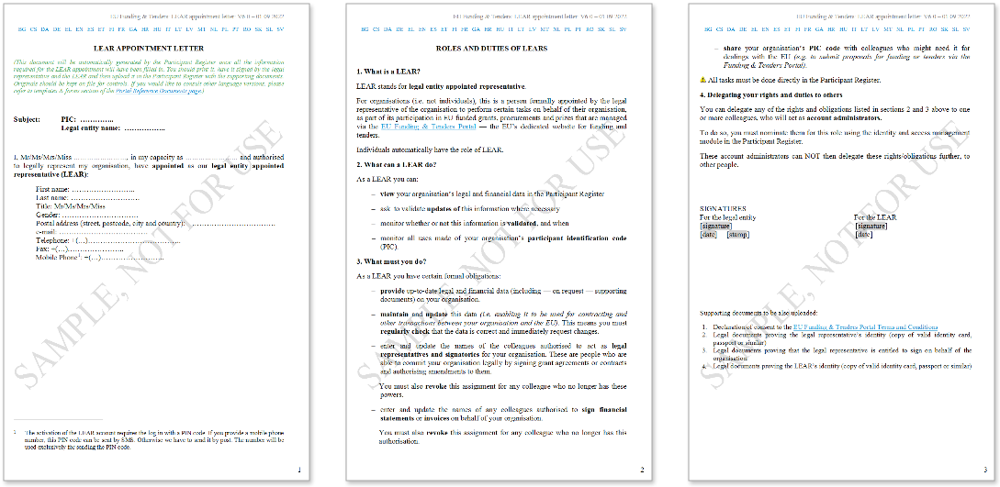
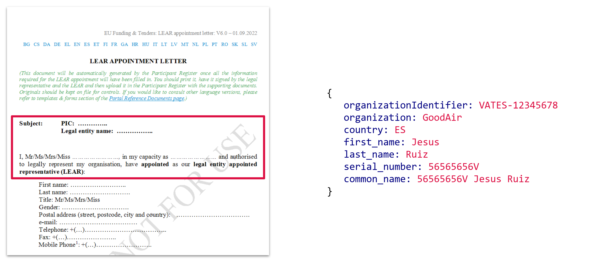
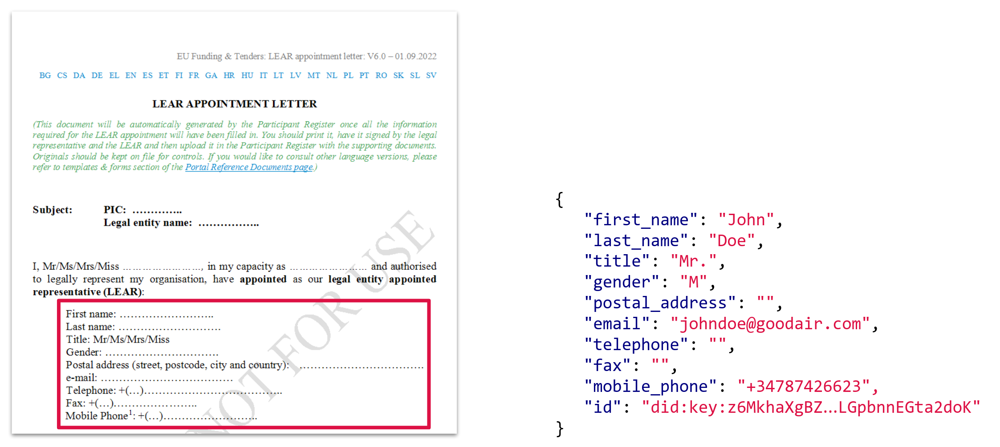
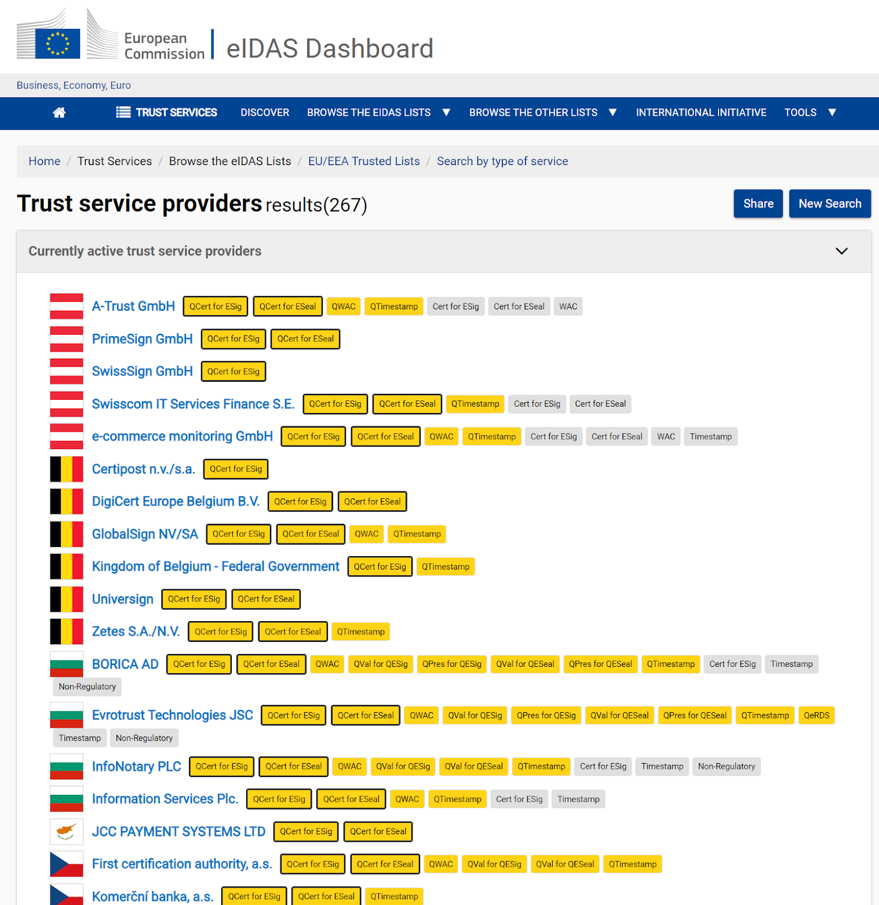
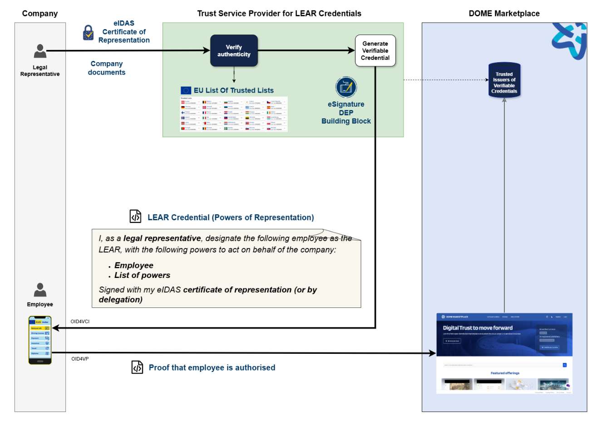
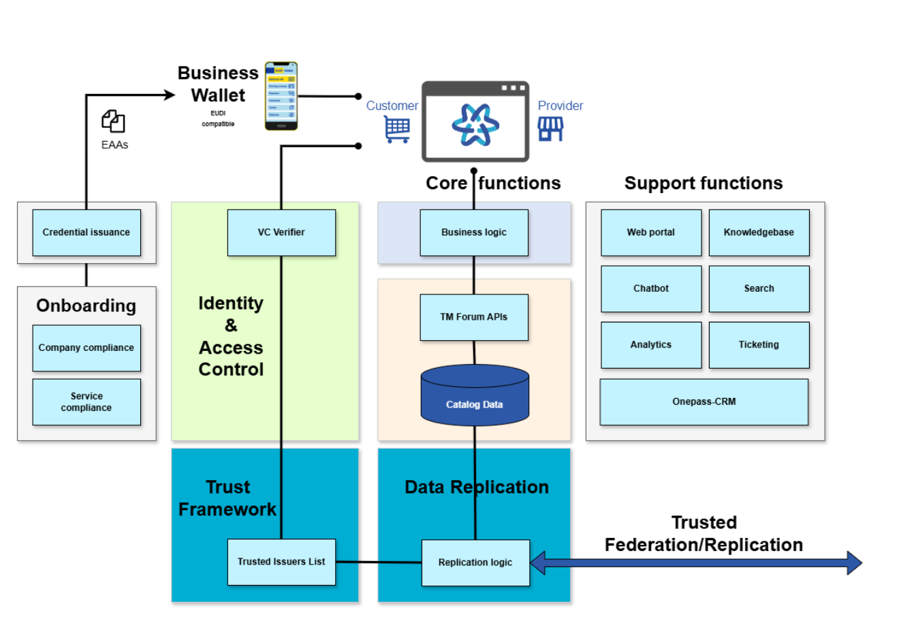

# 1. Relationship with the EUDI Wallet ecosystem

The DOME Identity and Access Management system is aligned with the eIDAS2 Regulation and the EUDI Wallet ecosystem. To describe the meaning of the word ‘alignment’ in this context, we reproduce here the picture in the [EUDIW Architecture and Reference Framework](https://github.com/eu-digital-identity-wallet/eudi-doc-architecture-and-reference-framework/blob/main/docs/architecture-and-reference-framework-main.md):


The whole ecosystem is still not in place (although we expect the second half of 2026 to be very active), but in reality it is an extension of the existing eIDAS Regulation, with a decade of experience and a well-defined legal framework.

The eIDAS regulation recognises the following types of trust service providers:

- **QCert for Esig/ESeal**: certification authorities issuing certificates for digital signatures supporting electronic signatures and seals;
- **QTimestamp**: time-stamping authorities providing proof of existence of a data object (including signed documents) at a given time;
- **QWAC**: certification authorities issuing certificates to support website authentication, aligned with the requirements of the CA/Browser Forum as recognised by all the major Web Browser Vendors;
- **QVal for QEsig/QESeal and QPres for QEsig/QESeal**: Providers of services for the validation and preservation of signed data;
- **QeRDS**: Providers of services for registered electronic delivery including registered electronic mail.

This has been extended in eIDAS2 with the definition of the EU Digital Identity Wallet and additional trust service providers:

- **PID**, **QEAA** and **Pub-EAA Provider**: Electronic Attestation of Attributes relating attributes and credentials to identified persons. These have the highest level of legal assurance, and are recognized across all EU member states.
- **EAA Provider**: The basic version, issued by any Trust Service Provider (TSP). While not meeting the highest “qualified” standards, it is enough for DOME. The signed PDF equivalent today is the one used in most electronic transactions (B2B, B2C, C2G, B2G, …).
- Creation of electronic signatures and seals using remote signing devices held in the cloud, as opposed to, for example, locally held smart card;
- **QeA**: Electronic Archiving services for the long-term preservation of electronic data, ensuring its durability and legibility over time
- **Qualified Electronic Ledgers**: service for recording electronic data in a way that ensures the integrity and accuracy of the data’s chronological order.

In DOME we have in production since summer 2024 a system fully compliant with eIDAS1 but using a subset of the technology of eIDAS2, which provides many efficiency and security advantages. The system is aligned with eIDAS2 and allows for a smooth migration as the EUDI Wallet ecosystem evolves and matures, with minimal or no impact on the applications.

This is a simplified picture to facilitate the description of how the DOME components fit in the EUDI Wallet architecture.


The following considerations apply.

## 1.1. The Wallet

There are still not fully compliant EUDI Wallets in the market, but DOME has an implementation of it with the subset of functionalities required for DOME. To be more precise, the DOME Wallet is an early implementation of the EU Business Wallet as described in the [Proposal for a Regulation on the establishment of European Business Wallets (November 2025)](https://digital-strategy.ec.europa.eu/en/library/proposal-regulation-establishment-european-business-wallets). It is important tonote that the DOME Wallet does not manage Person Identification Data (PID), but instead uses non-qualified attestations (EAAs) representing domain-specific electronic mandates.

The DOME Wallet receives credentials from Issuers using the [OpenID for Verifiable Credential Issuance 1.0 (OID4VCI)](https://openid.net/specs/openid-4-verifiable-credential-issuance-1_0.html) and presents attestations using [OpenID for Verifiable Presentations 1.0 (OID4VP)](https://openid.net/specs/openid-4-verifiable-presentations-1_0.html). It implements a proper subset of the functionalities, for example, it uses online flows and it does not support proximity flows.

The DOME Wallet is not intented for citizens, but focuses on the business environment. It is intended for employees and other natural persons acting on behalf of organisations.

Actually, there are two implementation of the Wallet done by independent organizations, and soon there will be more. However, the Wallet most used in practice and best supported is the one at <https://wallet.dome-marketplace.eu>. This Wallet is operated by DOME, until there are fully compliant EUDI Wallets and Business Wallets.

## 1.2. The Issuer and EEA Provider

In the context of DOME we use the term Issuer to refer to the software and the entity which issues the type of Electronic Attestations of Attribute (EAA) that employees have to present to interact with DOME.

DOME has an implementation of an Issuer, which uses OID4VCI to issue EAAs to Wallets and organizations.

The DOME Issuer generates credentials to an organisation automatically after the organisation has performed the Onboarding process in DOME.

DOME can accept credentials issued by any other Issuer operated by any other independent organisation, as long as it complies with some basic requirements:
- The assurance level of the verification of the identity of the organisation and its legal representative is compatible with the level required in DOME.
- The attestation issued complies with the format (ontology) used in DOME.
- The Issuer is registered in the Trusted Issuer List operated by DOME, or in any other recognised Trusted List (in the future, the eIDAS2 Trusted Lists).

Please note that at the moment, given the business requirements of DOME, we accept EAAs and QEAAs are not required. However, DOME will accept QEAAs when they are available (probably 2H26 or 1H27).

## 1.3. The Trusted Lists

DOME uses a combination of Trusted Lists:
- The [List of qualified trust service providers in the EU](https://digital-strategy.ec.europa.eu/en/policies/eu-trusted-lists) for the verification of digital signatures.
- The lists implemented and operated by DOME in its [Trust Framework](https://github.com/DOME-Marketplace/dome-trust-registry/tree/main).

The DOME Trust Framework contains:
- **Trusted Participants Registry.** The identities of organisations which are participants in the DOME instance
- **Trusted Issuers Registry.** The identities of organizations which DOME recognises as Issuers of the credentials used in DOME
- **Trusted Access Node Registry.** The identities of Access Nodes operated by independent organisations which can interact with DOME
- **Trusted Services Registry.** The identities of machines/workloads which can interact directly with the DOME APIs
- **Trusted Schemas Registry.** The credential schemas used in DOME

In addition, DOME operates the **Revoked Credential List** and the **Invalid Credentials List**.

The DOME Trusted Lists APIs are aligned with the ones in EBSI, in what we call the [EBSI-like Trusted Registry API](https://github.com/DOME-Marketplace/dome-trust-registry/blob/main/docs/openapi.yaml). In any case, we will evolve it to whatever final implementation is in eIDAS2 for these types of trusted lists. We already have in place the mechanisms to make the evolution transparent to applications.

## 1.4. The Relying Party: the DOME Marketplace and other applications

In DOME, applications use OpenID Connect Core for authentication. We have a component called the **VCVerifier** which handles the complexity of interactions with the Wallet, on behalf of the applications. A summary picture follows, but the details will be described later.


# 2. DOME Trust and IAM Framework

DOME uses **electronic mandates for authentication of employees acting on behalf of organizations**. These electronic mandates are represented in machine-readable format compatible with the EUDI Wallet (and the future Business Wallet) to facilitate automated processing and verification, and eliminate the slow, cumbersome and error-prone manual processes associated with traditional paper-based mandates.

DOME requires the eMandates to be **signed with an advanced signature or seal**, using an eIDAS qualified certificate issued by a QTSP (qualified trust services provider). This provides a level of legal certainty equivalent to any other business document signed in the same way, which is adequate for the overwhelming majority of business processes, including the ones in the DOME ecosystem.

In terms of eIDAS2, DOME accepts non-qualified EEAs (Electronic Attestation of Attributes), which facilitates its issuance and adoption:

- The eMandate can be **self-issued by the organization** which is the employer, using its HR database as the source of trust.
- Alternatively, it can be **issued by a trusted entity** (by DOME) which does not have to be a qualified trust services provider.

DOME has extended the concept of eMandate for an employee to **machines and workloads**: organizations (or trusted entities) can issue EEAs to machines/workloads controled by the organization, providing a very powerful machine-to-machine authentication and access control mechanism. We will focus initially of the eMandate for employees, and later will describe its usage with machines and workloads.

## 2.1. The electronic mandate (eMandate)

An electronic mandate (eMandate) is a digital representation of a legal authorization given by one entity (the mandator) to another (the mandatee) to perform specific actions or represent them in certain contexts. In the DOME platform, eMandates are crucial for enabling employees to act on behalf of their organizations.

A good way to understand the specific usage of eMandates in DOME is to describe a non-DOME well-know example and show how it is transposed to DOME.

### 2.1.1. An example of a mandate

To participate in the [EU Funding & Tenders Portal](https://ec.europa.eu/info/funding-tenders/opportunities/portal/screen/home), organizations must appoint a **LEAR**.
The LEAR (Legal Entity Appointed Representative) is a person, usually an administrative staff member in the central administration, appointed by the legal representative of the organisation (CEO, rector, Director-General, etc.). His/her tasks are to manage the legal and financial information of the organisation in the Participant Register on the Funding & Tenders Portal and to provide and update the list of persons in his/her organisation who are authorised to sign grant agreements (LSIGN) or financial statements (FSIGN).

This appointment is formalized with the LEAR Appointment Letter, which is effectively a mandate. An overview of the LEAR Appointment Letter is shown in the following figure.



There are four sections of interest in that Letter:
1. the identification of the organization and the legal representative;
2. the identification of the appointed employee (the LEAR);
3. the description of what the LEAR must/can do;
4. the signature of the document.

The first three sections correspond to the figures of Mandator (Legal Representative), Mandatee (employee appointed as LEAR), and delegated Powers that the employee has in the Portal.

The following figure focuses on the identification of the organization and the legal representative, and provides an example representation in JSON format.



The next figure focuses on the identification of the employee who will be appointed as LEAR, and an example representation in JSON.



Finally, the next figure focuses on the formal description on the powers that the LEAR must have, and an example representation in JSON format.


### 2.1.2. The mandate in DOME

The above can be generalized to map the different sections of the LEAR Appointment Letter to the DOME eMandate, as shown in the following figure. This mapping ensures that all relevant information from the traditional mandate is accurately translated into its digital equivalent, facilitating automated processing and verification within the DOME platform.

You can see that the eMandate has an object called `mandate`, which contains the `mandator`, `mandatee`, and `power` objects, mirroring the structure of the LEAR Appointment Letter. You can also see that we use an eIDAS signature to sign the eMandate. This signature not only ensures its authenticity and integrity, but it also provides linkage to the real-world identity of the organization that appointed the LEAR, providing a proper level of legal certainty that other types of signatures can not provide.

!\](mapping_mandate.png)

We will talk now about the properties of the signature. But first, let’s talk about the Trust Framework that we use in DOME

## 2.2. The Chain of Trust

The DOME Trust Framework relies upon the principles of eIDAS (electronic IDentification, Authentication and trust Services) Regulation, which provides a legal framework for electronic identification and trust services across the European Union. This framework ensures a high level of security, interoperability, and legal certainty for electronic transactions.

An overview of the chain of trust used in DOME is shown in the following figure. We elaborate on important details in the sections below.


### 2.2.1. The Trusted Root: EU Trusted Lists

According to the eIDAS Regulation, EU countries have the obligation to establish, maintain and publish trusted lists of qualified trust service providers (QTSPs) and the services provided by them. The services provided by a QTSP **is qualified only if it appears in a trusted list**.

There are different trust services that can be provided by the QTSPs, but the ones relevant for DOME are the issuance of qualified certificates for electronic signatures and seals.

In DOME we do not have any CA (Certification Authority) in our ecosystem, and we do not issue any type of X.509 certificate. We rely on the eIDAS certificates issued by the QTSPs, so our trusted roots are the ones in the [eIDAS trusted lists](https://digital-strategy.ec.europa.eu/en/policies/eu-trusted-lists).

There are many QTSPs in the EU, where any organization can obtain a certificate from any QTSP in any EU country issuing certificates for signatures/seals. Organizations are not limited to QTSPs in its country: many QTSPs provide remote identification services for legal representatives of organizations in other countries.



In DOME we trust on any QTSP which is included in the EU Trusted Lists.

### 2.2.2. The QTSP and Authentic Sources


In DOME we accept both seals and signatures because when a transaction requires a qualified electronic seal from a legal person, a qualified electronic signature from the authorised representative of the legal person is equally acceptable. For brevity, we will use the terms “organization certificate” or “certificate issued to an organization” to refer to both certificates for seals issued to an organization and certificates for signatures issued to a legal representative of the organization.

QTSPs issuing qualified certificates to organizations should implement the necessary measures in order to be able to establish the identity of the natural person representing the legal person to whom the qualified certificate is provided.
In order to do so, QTSPs may use different mechanisms, one of which may be to verify the identity of the organization and of the legal representative against the Authentic Sources.

This is a key property of the mechanism used in DOME: if a person presents a qualified organization certificate and proves control over the private key of the certificate, we automatically heve these benefits:
- We do not have to request any documents from the organization or the legal representative and verify them against the authentic sources (e.g., business registry), because the QTSP has already performed the checks, with a high level of assurance.
- We know that the person presenting the certificate is indeed the legal representative of the organization, because of the mechanism that was used to issue the certificate, which must ensure the sole control of the certificate.

In a pan-european context, those are cumbersome and lengthy processes if we only use “traditional” paper/PDF documents.

### 2.2.3. Issuance of the mandate by the organization


The next link in the chain of trust is the issuance of the eMandate by the organization.

In DOME we are satisfied with an advanced signature or seal performed with a qualified organizational certificate. In terms of eIDAS2, we in DOME accept an EAA and do not require a QEAA (but of course, we are happy to accept also QEAAs).

The overwhelming majority of current business transactions using digital signatures require advanced electronic signatures or seals, because qualified signatures or seals are more complex to obtain, and are not required in the legal framework for most transactions.

This enables a very powerful feature: the eMandate can be generated by the organization itself, using the eIDAS certificate to sign it, and then issued to the employee, who will use it to authenticate in DOME, without the need for the organization to integrate with DOME, thus simplifying the process for organizations and reducing administrative burden, and allowing for a more decentralized approach, which is a key aspect of DOME, and a significant advantage over traditional centralized systems.

We do not need any QTSP or Business Register to issue the eMandate. The organization is the “authentic source” for whether a person is an employee or not, and we “trust” the signature of a business document using an advanced signature with a qualified certificate.
The legal certainty (in case there is litigation) is actually higher than if we used “traditional” methods..

The world, however, is not homogeneous and some organizations are not ready to issue themselves the eMandate. Instead of insisting on a purely digital process, we have implemented an alternative procedure which takes advantage of digital signatures if available, or resorts to a manual verification process when not. This is supposedly temporal until eIDAS2 is fully implemented and adopted in the EU. In summary, we have implemented and operate in DOME a TSP for the verification of documents from providers and issues Verifiable Credentials (EAA) representing the electronic mandate appointing the LEAR. This credential is called the LEARCredential and is described in detail later in this document.

The LEARCredential is digitally signed by a QTSP using cloud signature with a qualified certificate.

<figure>

<figcaption aria-hidden="true">trusted_issuer.png</figcaption>
</figure>

### 2.2.4. Authentication of the employee in DOME


The employee authenticates to DOME by presenting the eMandate using his/her EUDI-compatible Wallet (a Business Wallet in most cases).

Given that neither EUDI Wallets (for citizens) nor Business Wallets (for organizations) have been deployed yet in the EU, we in DOME provide since summer 2024 an implementation of a Business Wallet which organizations and its employees can use.

This Business Wallet is fully aligned with the eIDAS2 specifications, but we do not implement all of the requirements, only the ones which are required to implement the DOME use cases. For example, we do not require proximity flows and only support online flows.

We will talk more about the Business Wallet in another part of this document, but for now suffice to say that we have defined a “DOME profile” with the minimum requirements that Business Wallets have to comply in order to be able to be used in DOME.

### 2.2.5. Summary: Key characteristics of eMandates in DOME:

<figure>

<figcaption aria-hidden="true">overall_view_identity_components.png</figcaption>
</figure>

- **Digital Representation:** eMandates are entirely digital, eliminating the need for physical documents and streamlining processes.
- **Legal Authorization:** They carry legal weight, ensuring that actions performed by the mandatee on behalf of the mandator are legally binding.
- **Specific Powers:** Each eMandate clearly defines the scope of authority granted, detailing the specific actions the mandatary is authorized to perform.
- **eIDAS Signatures:** eMandates are secured with eIDAS digital certificates, ensuring authenticity and integrity.
- **Non-repudiation:** eIDAS signatures and audit trails ensure that actions performed with an eMandate cannot be denied.
- **Flexible Issuance:** They can be signed directly by the legal representative or delegated to a trusted entity.
- **Ontology-based Powers:** The powers granted within an eMandate are defined using a specific ontology, allowing for precise and standardized representation.
- **Interoperability:** DOME eMandates are designed to be interoperable with other systems and platforms that support EUDI EAAs and Verifiable Credentials.
- **Auditability:** All actions performed using an eMandate are logged, providing a clear audit trail.
- **Decentralized Trust:** While DOME provides a trusted entity for delegation, the architecture supports decentralized trust models, allowing other trusted entities to be used.
- **Granular Permissions:** The ontology-based powers allow for fine-grained control over the actions an employee can perform.
- **Lifecycle Management:** eMandates have a defined lifecycle, including issuance, activation, suspension, and revocation.
- **User-Friendly:** Simplifies the process of delegating authority and managing permissions for organizations and their employees.
- **Scalability:** The digital nature and automated processing capabilities of eMandates allow for efficient management of a large number of mandates and users.
- **Global Reach:** The adherence to open standards and international frameworks like eIDAS facilitates cross-border recognition and use of eMandates.
- **Interoperability with EUDI Wallet:** Seamless integration with the European Digital Identity Wallet for secure and standardized mandate management.
- **Future-Proof:** Built on open standards and evolving digital identity frameworks, ensuring long-term relevance and adaptability.
- **Streamlined Onboarding:** Facilitates quicker and more efficient onboarding of new employees and partners by digitizing the authorization process.

## 2.3. The LEARCredential

The `LEARCredential` is a machine-readable legal document representing an electronic mandate (known also as Company Authorization Letter). In this context, the term `mandate` is used to describe the concept of **delegating specific permissions and powers to an employee of an organisation, enabling that employee to act on behalf of the company in a specific set of matters or tasks**.

We explicitly focus on the business environment and do not cover natural persons acting as citizens.

Instead of inefficient and insecure paper or PDFs, in DOME we use **Verifiable Credentials** to represent an eMandate. Given that we are in the EU, in DOME we use **eIDAS electronic signatures or seals** to make the credential a legal document with higher legal certainty than using other types of digital signatures (for example, a qualified electronic signature has in the EU the same legal validity as a handwritten signature).

In DOME, the specific powers being delegated are related to the interaction of an employee of an organisation with the DOME ecosystem, for example to authorise the employee perform onboarding, creating a Product Offering in the marketplace or contracting a product from a provider.

The LEARCredential (**L**egal **E**ntity **A**uthorised **R**epresentative **Credential**):
- is a Verifiable Credential that a legal entity (an organisation) issues to an employee (or subcontractor),
- includes the list of specific powers (or authorisations) that are delegated to an employee, so the employee can act on behalf of the legal entity
- can be used also as an **authentication mechanism**, eliminating the need for passwords or complex identity management systems
- the receiver of the credential can perform **access control** using the powers that are included inside the credential.

The figure below describes a high-level view of the LEARCredential.


The data model of the LEARCredential is based in the [RPaM-Ontology](https://github.com/everis-rpam/RPaM-Ontology/wiki/Ontology-Development-Report), which is a project started in 2018 by the Directorate-General for Informatics (DG-DIGIT) of the European Commission, funded by the ISA Programme, to organise and support the development of an ontology about the **Representation of Powers and Mandates**, from now on the RPaM Ontology.

We adapt the results of that project, with simplifications and specialisations, to the concrete environment where we use the LEARCredential. To facilitate the job of the reader of this document, in some sections we copy literal sentences from the RPaM Ontology project, and adapt the texts to our requirements. However, the reader is encouraged to access the original documents for more details and understand the original approach, including the [RPaM Ontology Glossary](https://everis-rpam.github.io/Glossary.html).

### 2.3.1. The Mandate

According to the RPaM Glossary, a “mandate is a record that describes the terms under which a mandator grants a representation power to a mandatee”.

In DOME, the mandate is composed of three related objects: `mandator`, `mandatee`, `power` and `signer`. The mandate object is signed or sealed with an advanced or qualified signature or seal using an eIDAS certificate.

#### 2.3.1.1. Mandator

The object mandator identifies the employee of the company who is delegating a subset of her powers on the mandatee.

The mandator is either:

- a legal representative of the company, according to the official records associated to the incorporation of the organisation (e.g., the business registry of the country of incorporation); or

- an employee who is a mandatee in another mandate where the mandator is a legal representative of the company. We do not support more than two levels of delegation.

#### 2.3.1.2. Mandatee

The mandatee is the person granted with the power to represent (and act as) the company in some specific actions with third-parties. The powers granted to the mandatee must be a subset of the powers of the mandator. For example, an employee (the mandatee) can be empowered by the legal representative of the company (the mandator) to perform the onboarding process in DOME.

The object mandatee identifies the employee on whom a subset of powers is delegated. The mandatee object contains:

- A set of attributes of the employee which are required by the specific use case where the LEAR Credential will be used, for example to onboard in the DOME ecosystem and for creating a ProductOffering in the marketplace. Those attributes can be considered equivalent to the fields that would be filled in a form when a “classical” PDF document would be used to authorise an employee.

- A public key associated to the employee and where the employee is the sole controler of the associated private key. This is required to enable the use of the LEARCredential containing the mandate as an efficient, scalable and secure authentication and authorisation mechanism.

The private key controlled by the employee is used to prove to Relying parties receiving the LEARCredential that the holder and presenter of the credential is the same person identified in the mandatee object. We support two mechanisms for the public key in the mandatee object:

- Using a did:key where the employee controls the private key associated to the did:key.
- Using an eIDAS certificate owned by the employee. This is very rare today (end of 2024), but will become more common when eIDAS2 and the EUDI Wallet is adopted.

#### 2.3.1.3. Signer

The Signer is either the Mandator or a third-party that attests that the Mandator really delegated the powers to the Mandatee. The Signer is the entity that performs an advanced or qualified signature or seal using an eIDAS certificate.

The Signer is the entity that has to be trusted by the receiver of the LEARCredential.

#### 2.3.1.4. Power

This object is a list of each specific power that is delegated from the mandator to the mandatee. The powers must be concrete and as constrained as possible, and must follow a taxonomy with the semantics well specified.

In DOME, we have specified a power taxonomy targeted at the interactions with the DOME Federated Marketplace. This means that the actions are well defined, homogeneous and standardised for the ecosystem. We are basically replacing the current mechanisms for Mandates (e.g., paper or PDF) with a more efficient, machine-processable representation in the form of a Verifiable Credential.

Our Power Taxonomy could be generalised to other actions involving private sector companies, but it is out of scope of this version of the document.

The `power` object is an array where each element is a power that is delegated from the Mandator to the Mandatee. The fields of each power object are:

- `id`: REQUIRED. The identifier of the power, which must be unique in the context of the Credential where it is included. It can be used as a reference when performing access control, for example in the audit records to identify the specific power that was used to grant access to some protected resource.

- `powerSource`: OPTIONAL. The Mandator draws the power from one (or more) sources of power, e.g., 1) a concrete Legislation; 2) a piece of evidence (as another Mandate, in which case the mandator was a mandatee in that other mandate) and/or 3) a Natural Person with a specific profession that invest him/her with the authority to order to a mandator with a specific role the creation of a mandate, e.g. a judge authorising a civil servant (a `Mandator` that is a Natural Person with the appropriate role) to create a mandate for a relative to represent an incapacitated person).

  In DOME, there are three cases with specific sources of power:

  - When the Mandator is a legal representative of the company, and the LEARCredential is signed with the eIDAS certificate of representation of the legal representative. In this case, the `powerSource` claim can be ommitted as it is implicit in the eIDAS signature. Alternatively, the `powerSource` claim is an object with the following fields:

    - `type`, with value `eulaw`.
    - `evidence`, with value [“https://eur-lex.europa.eu/legal-content/EN/TXT/?uri=CELEX:32014R0910”](https://eur-lex.europa.eu/legal-content/EN/TXT/?uri=CELEX:32014R0910).

  - When the Mandator is a natural person who is the Mandatee in another LEARCredential. The `powerSource` claim is an object with the following fields:

    - `type`, with value `LEARCredential`.
    - `format`, with the value `jwt_vc_json`.
    - `evidence`, with the LEARCredential where the Mandator is a Mandatee, in `jwt_vc_json` format.

  - When the Mandator is a legal representative of the company, but does not have an eIDAS certificate of representation, the Mandator can not sign the LEARCredential. In this case, there must be a trusted third-party which attests that the Mandator is effectively a legal representative of the company. This trusted third-party must perform the required due diligence to confirm the relationship, and then sign the credential with its eIDAS certificate.

    In DOME, one of the trusted third-parties (trusted by DOME) is the DOME Operator itself, where the employees dedicated to the onboarding of participants perform the manual checks on the documentation provided by the Mandator/Mandatee, and then create and sign the LEARCredential.

    In this case, the `powerSource` claim is an object with the following fields:

    - `type`, with value `attestation`.
    - `evidence`, with value the eIDAS certificate of the attester.

    In this case, the `mandate` object must contain an additional object called `attester`, identifying the entity that makes the attestation and with the same fields as the `mandator` object in the case where the Mandator signs the LEARCredential with an eIDAS certificate.

- `type`: REQUIRED. The type of power, which in DOME may be:

  - `Domain`: The mandatee has access to the services provided by one or more organisations where the services have been classified as belonging to that domain. Access to the services is subject to the restrictions defined by `action` and `function` below. The classification of services is arbitrary and is defined by the service providers. A typical scenario is when some service providers agree on a classification of the services that they provide collaboratively in the context of an ecosystem (like DOME), and the possible domains are made public, including the mapping to a given set of services in each provider.

  - `Organization`: The mandatee has access only to the services provided by one or more organizations, identified specifically in the power.

  Other types of powers can be defined, making the system extensible.

- `domain`: REQUIRED when the `type` claim has the value `Domain` or `Organization`. It is an array with the names of the Domains or Organisations where the Mandatee is authorised to interact with this Mandate.

  The names must be unique (e.g. via a namespace) to avoid potential clashes in different ecosystems.

  In DOME, for the powers of onboarding in DOME and for creating a `ProductOffering`, the `domain` claim must be an array with a single item with the value `DOME`.

- `function`: A string specifying the name of the function that the Mandatee can perform. The definition of the possible functions is done by the Relying Party (the entity with which the Mandatee will interact with the LEAR Credential).

  In DOME, two essential functions for Cloud Service Providers (CSP) accessing the marketplace are `Onboarding` and `ProductOffering`, which enable the Mandatee to use the services provided by DOME to onboard organisations in the ecosystem and (if it is onboarded previously) to create a ProductOffering, respectively.

- `action`: An array with the concrete actions belonging to the function that the Mandatee is allowed to execute.

  In DOME, the possible actions for CSPs accessing the marketplace are:

  - `Execute` when `function` is `Onboarding`.
  - Any combination of `Create`, `Update` and `Delete` when `function` is `ProductOffering`.

## 2.4. Authentication with the LEARCredential

Authentication in DOME with the LEARCredential can be performed both for Human-to-Machine (H2M) and Machine-to-Machine (M2M) use cases.

DOME uses Verifiable Credentials for authentication and access control of the entities interacting with the DOME services.

This is an overview of **how you can integrate the DOME authentication mechanism in your own applications**.
For details, see the [Verifier API](https://github.com/DOME-Marketplace/dome-altia-verifier-aio).

There are two types of entities that can authenticate to DOME services:

- Employees of companies using DOME services. We call this the Human-to-Machine (M2M) flows.
- Applications or machines owned or operated by an organisation, accessing the DOME services. We call this the Machine-to-Machine (M2M) flows.

We first explain the H2M flow: how your application can authenticate employees of companies (including your own company, of course). Later we describe the M2M flow.

### 2.4.1. Human-to-Machine (H2M) authentication flow


DOME provides a component called the [VCVerifier](https://github.com/DOME-Marketplace/dome-altia-verifier-aio) which makes very easy for applications to integrate authentication with Verifiable Credentials. The VCVerifier component hides the complexity of the [OpenID for Verifiable Presentations (OID4VP)](https://openid.net/specs/openid-4-verifiable-presentations-1_0.html) protocol required to talk to the Wallet.

The VCVerifier component uses standard OpenID Connect protocol with the application, and uses OID4VP to request authentication to the Wallet and receive the Verifiable Credential.

For the Application, the VCVerifier is just an OpenID Provider (OP), so any application which can use standard <a href="https://openid.net/specs/openid-connect-core-1_0.html">OpenID Connect</a>, either directly or through an OpenID Provider like Keycloak, can authenticate users with Verifiable Credentials using the DOME VCVerifier component. If you use Keycloak or other OpenID Provider, you have to configure it as an identity broker, in the same way as you would do if using social logins (e.g., Google, Facebook, etc.).

Once the VCVerifier has received the Verifiable Credential from the Wallet and performed a set of verifications (according to a defined policy), it sends to the Application an ID_token containing standard OPenID claims derived from the contents of the Verifiable Credential. The ID_token also contains some non-standard claims, in particular one with the whole Verifiable Credential received from the Wallaet.

If the application only requires standard claims like first-name, last_name or email, then using Verifiable Credentials as authentication mechanism is just a configuration task.

However, if the application requires the whole set of information in the Verifiable Credential, it has to support the non-standard claims and extract the information from the Verifiable Credential.

#### 2.4.1.1. Parameters of the VCVerifier

You have to tell your Application some things before it can talk to the VCVerifier.

When talking to the VCVerifier, your Application MUST use the OIDC **Authorization Code Flow**. No other OIDC flows are supported.

Your Application must use the following endpoints of the VCVerifier during the flow:

- **Authorization Endpoint**: https://verifier.dome-marketplace.eu/auth
- **Token Endpoint**: https://verifier.dome-marketplace.eu/token
- **UserInfo Endpoint**: https://verifier.dome-marketplace.eu/userinfo

https://verifier.dome-marketplace.eu/oidc/authorize?state=6cf8b5dd-3fc9-4d6b-bc64-722badb5a419&client_id=did:key:zDnaeTU39Wx9KXgmEwmfXsZSyEVxgCqwCVmoPyVQUTD8bhW8a&response_type=code&request_uri=https://dome-marketplace.eu/auth/vc/request.jwt&scope=openid learcredential&nonce=56a091bb-ad1e-47f0-bc8b-7dfe99a6bae4

#### 2.4.1.2. Starting the Authentication Request

Before any authentication can take place, your Application has to be registered with the VCVerifier. This is done during the onboarding process in DOME, or at any time later, contacting the onboarding team.

As part of the registration, you will receive a **Client Identifier** and a **Client Secret**, that your Application must use according to the OIDC standard.

Typically, you will display to the user a Login button, and when the user clicks the button, your Application will redirect the user to the VCVerifier, passing some parameters as per the OIDC specifications. This is called an **Authentication Request**.

The following is an example HTTP 302 redirect response by the Application, which triggers the browser of the user to make an Authentication Request to the Authorization Endpoint of the VCVerifier (with line wraps within values for display purposes only).

``` http
HTTP/1.1 302 Found
Location: https://verifier.dome-marketplace.org/auth?
    response_type=code
    &client_id=did:key:wejkdew87fwhef9833f4
    &request_uri=https%3A%2F%2Fdome-marketplace.org%2Fapi%2Fv1%2Frequest.jwt
    %23GkurKxf5T0Y-mnPFCHqWOMiZi4VS138cQO_V7PZHAdM
    &state=af0ifjsldkj&nonce=n-0S6_WzA2Mj
    &scope=openid%20learcred
```

Note the following:

- The Authentication Request MUST use the **Authorization Code Flow**, by specifying **response_type=code**. This means that all tokens (including the claims of the Verifiable Credential) are returned from the Token Endpoint.

- The **client_id** is the one assigned to your Application when registered in the VCVerifier.

- The Authentication Request MUST include the scope **learcred**, which tells the VCVerifier that the Application is requesting a LEARCredential (the one used in DOME for authentication). This scope is added to the OIDC compulsory scope **openid**.

- The Authorization Request MUST use the **request_uri** parameter which enables the request to be passed by reference, as described in [section 6.2. Passing a Request Object by Reference](https://openid.net/specs/openid-connect-core-1_0.html#RequestUriParameter) of the OpenID Connect spec.

- **state** is used by your Application to match this request with the future reply, in order to support multiple users at the same time.

#### 2.4.1.3. Receiving the Verifiable Credential in your Application

After the execution of the Authorization Code Flow, your Application can receive the Verifiable Credential in two ways:

- As an additional claim in the Access Token from the VCVerifier Token Endpoint. When your Application calls the Token Endpoint, it receives a normal access token which includes the claim **verifiableCredential**, which is the LEARCredential in JSON format.

- As an additional claim in the response from the Userinfo endpoint. The claim name is the same as in the access token: **verifiableCredential**.

The contents of the LEARCredential can be used by the Application to perform not only authentication but also authorization (access control). For example, using the Powers of the User which are included in the LEARCredential.

### 2.4.2. Machine-to-Machine (M2M) authentication flow


The VCVerifier component of DOME support also the M2M flows. The figure above shows a server application using the VCVerifier to exchange a Verifiable Credential for an Access Token, and then using the token to access protected resources. The M2M (machine-to-machine) flow for authentication is simpler than the one for H2M, because there is no user authentication involved.

The credential used by the Application for authenticating to the VCVerifier is the LEARCredential that was generated for the Application when registering it to the VCVerifier (the same process as in the H2M flow).

The M2M flow uses the **Client Credentials Grant**, following the [OAuth 2.1 IETF draft (12 July 2024)](https://datatracker.ietf.org/doc/html/draft-ietf-oauth-v2-1-10), which among other things takes into account the [OAuth 2.0 Security Best Current Practice](https://oauth.net/2/oauth-best-practice/) and consolidates several new RFCs that are relevant for our use case.

#### 2.4.2.1. Authenticating and receiving an Access Code

The M2M flow uses a Token Endpoint specifically for M2M:

- **M2M Token Endpoint**: https://verifier.dome-marketplace-prd.org/token_m2m

This is an example request to the M2M Token Endpoint:

``` http
POST /token_m2m HTTP/1.1
Host: verifier.dome-marketplace.org
Content-Type: application/x-www-form-urlencoded

    grant_type=client_credentials&
    client_assertion_type=urn%3Aietf%3Aparams%3Aoauth%3Aclient-assertion-type%3Ajwt-bearer&
    client_assertion=eyJhbGciOiJS[...omitted for brevity...]cC4hiUPo
```

The M2M flow MUST use the Client Credentials Grant (**grant_type=client_credentials**), because there is no user involved.

For authentication, the Application MUST use the **private_key_jwt** method, as described in section [9. Client Authentication](https://openid.net/specs/openid-connect-core-1_0.html#ClientAuthentication) of the OIDC standard.

The value of the **client_assertion_type** parameter MUST be **urn:ietf:params:oauth:client-assertion-type:jwt-bearer**, and the authentication token MUST be sent as the value of the **client_assertion** parameter.

The authentication token is created by the Application using the LEARCredential. The JWT in the **client_assertion** contains:

- **iss**: REQUIRED. This MUST contain the client_id of the OAuth Client, which is the `did` assigned to the machine in the LEARCredential of the machine. For example **did:key:wejkdew87fwhef9833f4**

- **sub**: REQUIRED. This MUST contain the same value as the `iss` claim.

- **aud**: REQUIRED. The aud (audience) claim MUST contain the URL of the VCVerifier’s M2M Token Endpoint (https://verifier.dome-marketplace-prd.org/token_m2m). The value shall be sent as a string, not as an item in an array.

- **jti**: REQUIRED. JWT ID. A unique identifier for the token, which can be used to prevent reuse of the token. Ideally, these tokens are used once. Given the very low value of the expiration time of the JWT (see below), the cache of already used `jti` claims can be held in memory, because an expired JWT MUST not be accepted even if the `jti` has not been seen before.

- **exp**: REQUIRED. Expiration time on or after which the JWT MUST NOT be accepted for processing. In a M2M flow, this JWT is used only once and the client generates the JWT immediately before using it to call the token endpoint of the VCVerifier, with no human intervention or intermediate complex processes. The expiration time MUST be set as low as possible while allowing network delays, the major component that may affect this parameter. For example, **10 seconds**, which is more than enough in most situations. In case of bad network conditions, the authentication can be retried with a new JWT. This is important for Replay protection, while simplifying management of unique `jti` claims in VC Verifier.

- **iat**: OPTIONAL. Time at which the JWT was issued.

- **verifiableCredential**: REQUIRED. This MUST contain the LEARCredential in JWT format.

The authentication token MUST be signed with the private key associated to the did:key uniquely associated to the machine/application calling the M2M Token Endpoint, which MUST be the same as the did:key inside the LEARCredential in the **verifiableCredential** claim of the authentication token.

If the VCVerifier authenticates correctly the Application, it answers with an Access Token as described in section [3.1.3.3. Successful Token Response](https://openid.net/specs/openid-connect-core-1_0.html#TokenResponse) of the OIDC specification.
