|   |
|----------------------------------------------|

D3.9 DOME APIs (v3)

**Project full title**

A Distributed Open Marketplace for Europe Cloud and Edge Services

**Contract No.**

101084071

**Strategic Objective**

DIGITAL-2021-CLOUD-AI-01-DS-MARKETPLACE-CLOUD

**Project Document Number**

DOME-D3.9

**Project Document Date**

12.08.2025

**Deliverable Type and Security**

REPORT, PUBLIC

**Main editor**

IN2, Ingeniería de la Información, S.L.

**Contributors**

Oriol Canadés (ALTIA / IN2)

Jesus Ruiz

Daniel Ros (Libelium)

**Revisión**

Alejando Nieto (DigitelTS)

Alejandro Alfonso (DigitelTS)

Robert Florescu (BEIA)

**Log Table**

| **Version** | **Date** | **Change** | **Author/partner** |
|----|----|----|----|
| v0.1.0 | 13/12/23 | First draft version shared | Oriol Canadés (IN2) |
| v0.1.1 | 19/12/24 | Revised version | DigitelTS |
| V.1.0 | 19/12/25 | Updated to Final Version | DigitelTS, Robert Florescu, Nicolae Goga, Mihai Butolo (BEIA) |
|  |  |  |  |

**Table of Contents**

[1. Introduction 8](#introduction)

> [1.1. Executive Summary 8](#executive-summary)
>
> [1.2. Intended audience 8](#intended-audience)
>
> [1.3. Structure of the document 8](#structure-of-the-document)
>
> [1.4. Related documents and resources
> 8](#related-documents-and-resources)

[2. Architecture 9](#architecture)

> [2.1. Persistence Layer Architecture
> 10](#persistence-layer-architecture)
>
> [2.2. Access Node Architecture 11](#access-node-architecture)
>
> [2.2.1. TM Forum APIs 12](#tm-forum-apis)
>
> [2.2.2. NGSI-LD Context Broker 12](#ngsi-ld-context-broker)
>
> [2.2.3. Replication Service 13](#replication-service)
>
> [2.2.4. DLT Adapter 13](#dlt-adapter)
>
> [2.3. Data flow between the instances
> 15](#data-flow-between-the-instances)
>
> [2.3.1. Replicating data through the blockchain.
> 16](#replicating-data-through-the-blockchain.)
>
> [2.3.2. Replicating data through other Access Node peers.
> 17](#replicating-data-through-other-access-node-peers.)
>
> [2.4. The process of retrieving data, enforcing replication policies,
> and validating/storing data remains identical.2.4 Data flow inside the
> Access Node
> 18](#the-process-of-retrieving-data-enforcing-replication-policies-and-validatingstoring-data-remains-identical.2.4-data-flow-inside-the-access-node)

[3. TM Forum APIs 20](#tm-forum-apis-1)

> [3.1. Introduction 20](#introduction-1)
>
> [3.2. Basic Concepts 20](#basic-concepts)
>
> [3.2.1. Main Entities 20](#main-entities)
>
> [3.2.2. Common properties of entities defined in TM Forum APIs
> 22](#common-properties-of-entities-defined-in-tm-forum-apis)
>
> [3.2.3. Lifecycle Status 27](#lifecycle-status)
>
> [3.3. Access Control to TMForum APIs
> 27](#access-control-to-tmforum-apis)
>
> [Access Control to the APIs use the LEARCredentialMachine
> 28](#access-control-to-the-apis-use-the-learcredentialmachine)
>
> [Access Control to the APIs use information of the object being
> accessed.
> 28](#access-control-to-the-apis-use-information-of-the-object-being-accessed.)
>
> [User-defined policies 29](#user-defined-policies)
>
> [Essential policies 32](#essential-policies)
>
> [3.4. TMF620 - Product Catalog Management
> 36](#tmf620---product-catalog-management)
>
> [3.4.1. Product Catalog 36](#product-catalog)
>
> [3.4.2. Category 37](#category)
>
> [3.4.3. Product Offering 38](#product-offering)
>
> [3.4.4. Product Specification 40](#product-specification)
>
> [3.4.5. Product Offering Price 42](#product-offering-price)
>
> [3.5. TMF622 - Product Ordering Management
> 44](#tmf622---product-ordering-management)
>
> [3.5.1. Product Order 44](#product-order)
>
> [3.6. TMF648 - Quote Management 47](#tmf648---quote-management)
>
> [3.6.1. Quote 47](#quote)
>
> [3.7. TMF637 - Product Inventory Management
> 50](#tmf637---product-inventory-management)
>
> [3.7.1. Product 50](#product)
>
> [3.8. TMF651 - Agreement Management
> 53](#tmf651---agreement-management)
>
> [3.8.1. Agreement 53](#agreement)
>
> [3.8.2. Agreement Specification 55](#agreement-specification)
>
> [3.9. TMF634 - Resource Catalog Management
> 58](#tmf634---resource-catalog-management)
>
> [3.9.1. Resource Catalog 58](#resource-catalog)
>
> [3.9.2. Resource Category 59](#resource-category)
>
> [3.9.3. Resource Candidate 60](#resource-candidate)
>
> [3.9.4. Resource Specification 61](#resource-specification)
>
> [3.10. TMF652 - Resource Ordering Management
> 63](#tmf652---resource-ordering-management)
>
> [3.10.1. Resource Order 63](#resource-order)
>
> [3.11. TMF639 - Resource Inventory Management
> 66](#tmf639---resource-inventory-management)
>
> [3.11.1. Resource 66](#resource)
>
> [3.12. TMF664 - Resource Function Activation and Configuration
> 68](#tmf664---resource-function-activation-and-configuration)
>
> [3.12.1. Resource Function 68](#resource-function)
>
> [3.13. TMF633 - Service Catalog Management
> 70](#tmf633---service-catalog-management)
>
> [3.13.1. Service Catalog 70](#service-catalog)
>
> [3.13.2. Service Category 71](#service-category)
>
> [3.13.3. Service Candidate 72](#service-candidate)
>
> [3.13.4. Service Specification 74](#service-specification)
>
> [3.14. TMF641 - Service Ordering Management
> 75](#tmf641---service-ordering-management)
>
> [3.14.1. Service Order 75](#service-order)
>
> [3.15. TMF638 - Service Inventory Management
> 77](#tmf638---service-inventory-management)
>
> [3.15.1. Service 77](#service)
>
> [3.16. TMF635 - Usage Management 79](#tmf635---usage-management)
>
> [3.16.1. Usage 79](#usage)
>
> [3.16.2. Usage Specification 82](#usage-specification)
>
> [3.17. TMF632 - Party Management 83](#tmf632---party-management)
>
> [3.17.1. Individual 84](#individual)
>
> [3.17.2. Organization 87](#organization)
>
> [3.18. TMF669 - Party Role Management
> 88](#tmf669---party-role-management)
>
> [3.18.1. Party Role 89](#party-role)
>
> [3.19. TMF629 - Customer Management 91](#tmf629---customer-management)
>
> [3.19.1. Customer 91](#customer)
>
> [3.20. TMF666 - Account Management 92](#tmf666---account-management)
>
> [3.20.1. Billing Account 92](#billing-account)
>
> [3.20.2. Settlement Account 94](#settlement-account)
>
> [3.20.3. Financial Account 96](#financial-account)

**List of figures**

- [**<u>Figure 2.1-1 - Persistence Layer Architecture</u>**](#2s8eyo1)

- [**<u>Figure 2.2-1 - Access Node Architecture</u>**](#26in1rg)

- [**<u>Figure 2.3-1 - Data flow between instances</u>**](#3j2qqm3)

- [**<u>Figure 2.3-2 - Data flow between Access Nodes</u>**](#2xcytpi)

- [**<u>Figure 2.4-1 - Data flow inside access node (offering
  creation)</u>**](#3whwml4)

- [**<u>Figure 2.4-2 - Data flow inside access node (offering
  consumption)</u>**](#2bn6wsx)

- [**<u>Figure 3.1.1-1 - TMForum main entities</u>**](#49x2ik5)

- [**<u>Figure 3.1.3-1 - Entity lifecycle status</u>**](#3o7alnk)

- [**<u>Figure 3.2.1-1 - Product Catalog</u>**](#32hioqz)

- [**<u>Figure 3.2.2-1 - Catalog</u>**](#41mghml)

- [**<u>Figure 3.2.3-1 - Product offering</u>**](#3fwokq0)

- [**<u>Figure 3.2.4-1 - Product specification</u>**](#2u6wntf)

- [**<u>Figure 3.2.5-1 - Product offering price</u>**](#3tbugp1)

- [**<u>Figure 3.3.1-1 - Product order lifecycle</u>**](#37m2jsg)

- [**<u>Figure 3.3.1-2 - Product order</u>**](#1mrcu09)

- [**<u>Figure 3.4.2-1 - Product</u>**](#3l18frh)

- [**<u>Figure 3.4.2-2 - Product lifecycle</u>**](#206ipza)

- [**<u>Figure 3.5.1-1 - Agreement</u>**](#1egqt2p)

- [**<u>Figure 3.5.2-1 - Agreement specification</u>**](#2dlolyb)

- [**<u>Figure 3.6.3-1 - Resource candidate</u>**](#2r0uhxc)

- [**<u>Figure 3.6.4-1 - Resource specification</u>**](#3q5sasy)

- [**<u>Figure 3.7.1-1 - Resource order</u>**](#34g0dwd)

- [**<u>Figure 3.7.1-2 - Resource order lifecycle</u>**](#1jlao46)

- [**<u>Figure 3.8.1-1 - Resource</u>**](#xvir7l)

- [**<u>Figure 3.8.1-2 - Resource lifecycle</u>**](#3hv69ve)

- [**<u>Figure 3.11.1-1 - Service order</u>**](#1opuj5n)

- [**<u>Figure 3.11.1-2 - Service order lifecycle</u>**](#48pi1tg)

- [**<u>Figure 3.12.1-1 - Service</u>**](#3mzq4wv)

- [**<u>Figure 3.12.1-2 - Service lifecycle</u>**](#2250f4o)

- [**<u>Figure 3.13.1-1 - Usage</u>**](#1gf8i83)

- [**<u>Figure 3.13.2-1 - Usage specification</u>**](#2fk6b3p)

- [**<u>Figure 3.14.1-1 - Individual</u>**](#1tuee74)

- [**<u>Figure 3.14.2-1 - Organization</u>**](#2szc72q)

- [**<u>Figure 3.15.1-1 - Party role</u>**](#meukdy)

- [**<u>Figure 3.17.1-1 - Billing account</u>**](#3jtnz0s)

**Acronyms**

| **Acronym** | **Definition**                                   |
|-------------|--------------------------------------------------|
| API         | Application Programming Interface                |
| NGSI-LD     | Next Generation Service Interfaces - Linked Data |
| TM Forum    | TeleManagement Forum                             |
| DLT         | Distributed Ledger Technology                    |

# 1. Introduction

## 1.1. Executive Summary

Standardized APIs are necessary to integrate external applications with
the DOME instance operated by the DOME Operator. There are different
possible types of interactions that we support, including CSPs and
federated marketplaces. Providers of such marketplaces need to connect
with the decentralized persistence layer through unique access nodes.
These access nodes are linked to the blockchain and other access nodes
and provide the DOME APIs for connection by the marketplaces. These DOME
APIs rely on the TM Forum APIs and allow to create and manage various
types of entities and their lifecycle at the DOME Marketplace.

This document describes the architecture of the persistence layer and
the access nodes, as well as the different data flows. In addition, a
description of the different TMForum entity types is given.

## 1.2. Intended audience

DOME partners involved in technical activities, Marketplace Integrators
and DOME reviewers.

## 1.3. Structure of the document

The document is divided into 3 chapters:

Chapter 1: Introduction - provides a summary of this document

Chapter 2: Architecture - gives an introduction of the Persistence Layer
and the Access Node, with a focus on the roles in providing the DOME
APIs

Chapter 3: TMForum APIs - a detailed description of the TMForum APIs
used to provide the DOME APIs

## 1.4. Related documents and resources

Following is a list of valuable links to relevant documents and
resources:

- [<u>DOME Technical Overview
  presentation</u>](https://docs.google.com/presentation/d/17vEx9bIUeVIUTqsiFyVqySC81gHoFs1K/edit?usp=sharing&ouid=107618755245949253912&rtpof=true&sd=true)

- [<u>DOME Overall
  Architecture</u>](https://docs.google.com/presentation/d/17vEx9bIUeVIUTqsiFyVqySC81gHoFs1K/edit?usp=sharing&ouid=107618755245949253912&rtpof=true&sd=true)

# 2. Architecture

The DOME ecosystem consists of a set of interconnected instances of
Marketplaces. Each Marketplace is operated by a different entity, and
they share a catalog of products and services via a decentralised
replication mechanism provided by the DOME project.

At the technical level, all instances are equal and they operate in a
peer-to-peer way. However, the DOME project defines the governance model
of the ecosystem, providing the rules and policies that must be followed
by a candidate Marketplace instance in order to join the ecosystem and
operate within it.

In this sense, we say that the ecosystem is a federation of marketplaces
and that each participating marketplace is a federated marketplace.

The DOME project also controls and governs one special instance of
federated marketplace, operated by a legal entity called the DOME
Operator. We will use the name DOME Instance to refer to this specific
instance.

In the initial stages of the DOME ecosystem, there are centralised
functions performed by the DOME project and the DOME Operator, required
to bootstrap the ecosystem.

However, as mentioned before, at the technical level the management of
the catalog has no central component and all marketplace instances are
the same.

This is the reason why the federated marketplaces do not have to use any
centralised API in order to manage their local replicas of the catalog
data.

Instead, each marketplace operator must install and operate a set of
software components provided by the DOME project called the Access Node.

The Access Node provides the following high-level functionalities:

- Manages a local replica of the catalog data. This means that each
  federated marketplace in the DOME ecosystem has a local replica of the
  catalog.

- A replication mechanism that, subject to configurable replication
  policies, connects to other instances of the Access Node in the
  ecosystem and maintains the local replica updated.

- Exposes locally a standard API to be used by the marketplace operator
  to interact with the local instance of the catalog data, performing
  replication automatically and transparently with other Access Node
  instances in the ecosystem. This is what we call in this document the
  DOME APIs.

The DOME APIs are used by each individual marketplace operator to
integrate whatever software they use for the actual marketplace
functionality that provides the user interface to their own customers,
or any other functionality that they want to implement.

The essential flows are the following:

- When a marketplace instance invokes the local DOME APIs to read from
  the local replica, the data is retrieved locally without any
  interaction with the other instances in the DOME ecosystem. The
  automatic replication mechanism provided by the Access Node keeps the
  local replica updated (there is a way to explicitly trigger
  replication if needed, but we do not describe it here and assume that
  the automatic process is enough).

- When a marketplace instance invokes the local DOME APIs to create or
  update catalog entities “owned” by the marketplace operator, the local
  replica is updated and a replication round is started to notify other
  instances of the Access Node in the ecosystem so they can be updated
  with the new data.

The focus of this document is on the DOME APIs and how to use them, so
we do not describe the technical details of how the replication
mechanism is implemented. This is described in other technical documents
provided by the DOME project. However, some high-level properties of the
replication mechanism are:

- Each relevant object in the DOME catalog has an “owner” entity, which
  is the entity that created the object. DOME uses digital signatures
  and Verifiable Credentials to provide a trusted and tamper-resistant
  replication mechanism of the catalog objects.

- This means that a marketplace operator can not impersonate another
  operator pretending that an object is owned by them if it was
  originally created by the other operator.

- In particular, a local operator can not write to the local replica
  modifying objects that it does not own.

The DOME APIs provide the capabilities for Marketplace Provider to
create and manage catalogs, products and offerings at the DOME
Marketplace. In order to participate at the Marketplace and use its
APIs, the provider needs to connect with the decentralized persistence
layer (see D3.1 DOME Reference Architecture and Specifications for the
detailed architecture).

This chapter will give an introduction to the architecture of the
Persistence Layer, the Access Node and the data flows between those
components.

## 2.1. Persistence Layer Architecture

The Decentralized Persistence Layer operates through interconnected
Access Node instances on a Blockchain. Each participant deploys their
unique Access Node instance and links it to the Blockchain using an
individual address. Separate from the Access Node is the
Marketplace-Implementation. While the [<u>FIWARE BAE
Marketplace</u>](https://github.com/FIWARE-TMForum/Business-API-Ecosystem)
offers an open-source implementation, the DOME APIs provided by the
Access Node enable the connection of individual Marketplaces to the
Decentralized Persistence Layer.

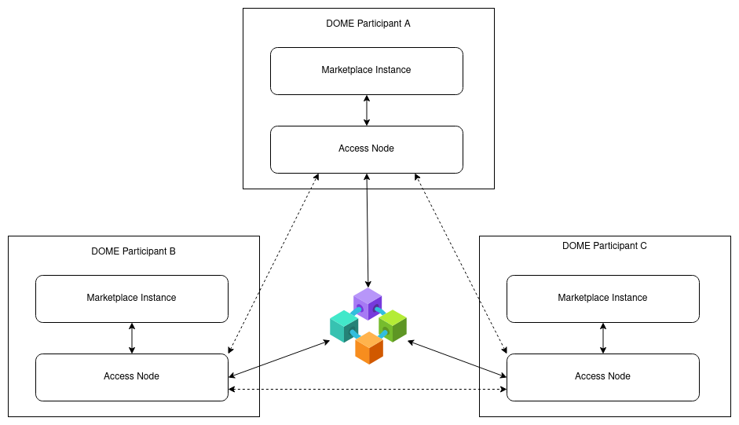

Figure 2.1-1 - Persistence Layer Architecture

Each Access Node connects bidirectionally to the Blockchain, performing
two key functions:

- Generating events for entity changes (e.g., resources created by
  Marketplace instances) and broadcasting them on the Blockchain.

- Listening for events from other Marketplace instances to mirror the
  source entities within its own Marketplace.

## 2.2. Access Node Architecture

As described in the above chapter, the Access Node bears several crucial
responsibilities:

- **Providing TMForum APIs to Marketplaces:** This involves granting
  access to standardized interfaces that facilitate smooth communication
  among various systems and applications.

- **Local Persistence of Entities Managed via TMForum APIs:** The Access
  Node stores these entities locally, ensuring their availability and
  integrity.

- **Broadcasting Entity Events on the Blockchain:** Events pertaining to
  entities are published on the Blockchain for consumption by other
  instances within marketplaces.

- **Monitoring Entity Events from Other Instances:** The Access Node
  listens for and interprets entity events broadcasted by other
  instances.

- **Resolving Entity Events and Local Storage:** It resolves entity
  events and stores the entities in its local instance.

- **Offering NGSI-LD API to Other Access Nodes:** Providing an interface
  that allows other Access Nodes to resolve events.

The Access Node comprises four essential components to execute these
functions: TM Forum APIs, the Context Broker, the Replication Service
and the DLT Adapter.

Figure 2.2-1 - Access Node Architecture

### 2.2.1. TM Forum APIs

TMForum APIs are a set of standardized interfaces developed by TM Forum.
These APIs are designed to facilitate interoperability and seamless
communication between different systems and applications.

In the DOME Marketplace, they are used to provide the DOME APIs as a
standardized API for Marketplace instances to connect to. The
implementation in the Access Node is provided as [<u>Open Source by the
FIWARE Foundation</u>](https://github.com/FIWARE/tmforum-api) and
transforms the resources into NGSI-LD compatible entities to be stored
in an NGSI-LD Context Broker. The NGSI-LD data format allows the usage
of further already available Open Source components, required by the
Access Node.

### 2.2.2. NGSI-LD Context Broker

An NGSI-LD Context Broker is designed to handle context information
following the NGSI-LD (Next Generation Service Interfaces - Linked Data)
standard. NGSI-LD is a data model and API specification proposed by the
European Telecommunications Standards Institute (ETSI) and adopted by
the Open Geospatial Consortium (OGC). It’s designed to manage and
exchange context information in a standardized and interoperable way.

In the DOME Access Node, it serves as the storage backend for the
TMForum APIs. Every Object from TMForum APIs is transformed into an
NGSI-LD Entity and therefore can be further handled in a uniform way.

Beside storing the entities, the Context Broker also offers the NGSI-LD
API towards other instances of the Access Node to allow them the
resolution of events consumed through the Blockchain. Since the events
do only contain a hashlink, Access Node Instances will request the
specific entities at their origin through the NGSI-LD API.

As a 3rd task, the Context Broker also provides notifications on
entities to other components inside the Access Node. Most importantly,
it informs the Blockchain Connector on all entity changes received
through the TMForum APIs.

### 2.2.3. Replication Service

The Blockchain Connector is the component responsible for all
interactions with the Blockchain as the decentralization mechanism in
DOME. It connects to EBSI-compatible Blockchains (as of now, they need
to support the Ethereum API) and requires the ability to sign
transactions with the identity of the participant.

When receiving a notification about entity changes from the NGSI-LD
Context Broker, the Blockchain Connector has to create the corresponding
Hashlink and publish it to the Blockchain. Additionally the Blockchain
Connector does listen to events on the Blockchain and evaluates the
incoming ones. The participant using the access node can be notified of
events of interest. The Hashlink from the event has to be resolved and
will be used to create the entity in the local Context Broker.

### 2.2.4. DLT Adapter

The DLT Adapter is the component responsible for direct interaction with
the blockchain network. It provides the access to the blockchain network
for the replication service to work on to propagate and receive DOME
events of interest for each access node.

**2.2.5. Trusted Registries**

The Trusted Registries is the component responsible for establishing
trust relationships according to the Trust Framework among actors of the
DOME Marketplace. It is based on the Trusted Registries API, which
allows CRUD operations over the following elements:

#### 2.2.5.1 List of Trusted Access Nodes

A Trusted Access Node is a trusted node in the DOME ecosystem which
holds a portion of the DOME’s decentralised data. The following fields
shape the Trusted Access Nodes:

- *DLT Address:* The Ethereum Address of the organization’s Access Node.

- *Name:* The name of the organization.

**2.2.5.2. List of Credential Issuers**

A Trusted Credential Issuer is a trusted public entity which can issue
Verifiable Credentials belonging to a given domain or of a given type.
The following fields shape the Trusted LEAR Credential Issuers:

- *OID:* The Organization ID of the Trusted Credential Issuer.

- *Attributes:* List of objects defining the issuer’s attributes. Each
  one of them must contain the following fields:

  - *Hash*

  - *Issuer Type*

  - *Body*

    - *Valid For:* Time range in which the credential is valid.

      - *From:* Start of validity.

      - *To:* End of validity.

    - *Credential’s Type*

    - *Claims:* List of objects representing the issuer’s claims. Each
      one of them must contain the following fields:

      - *Name:* The name of the claim.

      - *Allowed Values:* List of objects representing allowed claims.
        Each one of them may contain the following fields:

        - *Value:* The value which is allowed.

        - *Description:* A description of the value.

- *Has Attributes:* This field must be set to *true*, since Trusted
  Credential Issuers must have attributes.

#### 2.2.5.3. List of Trusted Participants

A Trusted Participant is a legal entity onboarded in DOME. The following
fields shape the Trusted Participants:

- *OID:* The Organization ID of the Trusted Participant.

- *Attributes:* This field must be empty.

- *Has Attributes:* This field must be set to *false*, since Trusted
  Participants can’t have attributes.

#### 2.2.5.4. List of Trusted Schemas

A Trusted Schema is an object describing a well-known credential schema.
The following fields shape the Trusted Schemas:

- *ID:* An identifier for the Trusted Schema.

- *Schema Data:* The schema JSON as a text string.

#### 2.2.5.5. List of Trusted Services

A Trusted Service is a verified and authorized service within the DOME
ecosystem. The following fields shape the Trusted Services:

- *Client ID:* Should be a *did:key* or a unique identifier for your
  client. Using a *did:key* allows the verifier to obtain your public
  keys for signature verification without needing a separate JWKS
  endpoint.

- *URL:* The base URL of your service or application.

- *Redirect URIs:* Must include all the URLs where you expect to receive
  authentication responses. These should be HTTPS URLs to ensure secure
  communication

- *Scopes:* Currently only *openid_learcredential* is allowed. This
  scope allows your service to request the necessary credentials.

- *Client Authentication Methods:* Currently the only supported
  authentication method is *client_secret_jwt*.

- *Authorization Grant Types:* List of supported grant types.

- *Post-Logout Redirect URIs:* Include the URLs where users should be
  redirected after they log out from your service.

- *Require Authorization Consent:* Whether explicit user consent is
  required or not.

- *Require Proof Key:* Whether PKCE is required or not.

- *JWT Set URL:* URL where your public keys can be fetched. This field
  is only needed if the Client ID is not a *did:key* identifier.

- *Token Endpoint Authentication Signing Algorithm:* Currently the only
  supported algorithm is ES256.

A web GUI is available to facilitate the managing of these trust
registries for the DOME Operator.

## 

## 2.3. Data flow between the instances

The dataflow between the instances is depicted by the diagram below at
the example of a product offering. There are two different flows, one is
related to the replication through the blockchain and the other to
Access Nodes peers.

### 2.3.1. Replicating data through the blockchain.

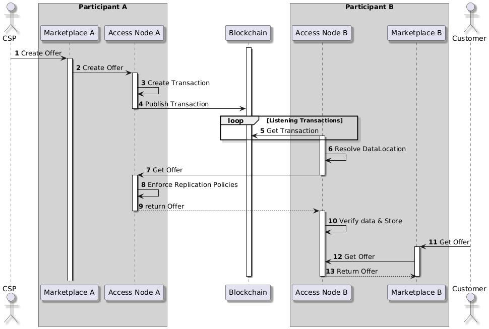

Figure 2.3-1 - Data flow between instances

The steps taken are:

1.  A provider creates the offer through the marketplace of participant

    1.  

2.  The marketplace instance calls the Access Node through its TMForum
    API and creates the entity.

3.  The Access Node generates the Hashlink and the corresponding event.

4.  The event is published to the blockchain.

5.  Access Node of Participant B is listening for events at the
    Blockchain.

6.  Once an event is received, the Access Node resolves the hashlink.

7.  The Access Node retrieves the entity from Access Node A.

8.  It verifies the Hash of the entity and stores it locally (inside the
    Context Broker).

9.  A Customer tries to retrieve the offer from Marketplace B.

10. Marketplace B retrieves the offer from the Access Node.

11. The Customer gets the offer.

### 2.3.2. Replicating data through other Access Node peers.

Figure 2.3-2 - Data flow between Access Nodes

The steps taken are:

1.  A scheduled task or CLI action triggers the flow in Access Node A.

2.  Access Node A retrieves a list of eligible Offers that are ready for
    replication.

3.  Access Node A compiles a list of relevant metadata and sends it to
    Access Node B.

4.  Access Node B retrieves its own list of Offers to compare with the
    received metadata.

5.  Upon detecting differences, Access Node B creates an internal event
    that triggers a data replication process for its own interests.

6.  Access Node B sends back a list of Offers that Access Node A can
    request for replication.

7.  If an internal event is detected:

    1.  Access Node B requests the eligible Offers.

    2.  Access Node A retrieves the requested data.

    3.  Access Node A enforces replication policies.

    4.  Access Node A returns the Offers back to Access Node B.

    5.  Upon receiving the new data, Access Node B. Validates the data
        and stores it in its system.

8.  If replication occurs in the opposite direction.

    1.  Access Node B requests eligible Offers from Access Node A.

## 2.4. The process of retrieving data, enforcing replication policies, and validating/storing data remains identical.2.4 Data flow inside the Access Node

The following diagrams concentrate on the data flow inside the access
node. It shows the same Use-Case of creation and consumption of an
offering, but its split in the creation and consumption part for better
readability.

Figure 2.4-1 - Data flow inside access node (offering creation)

The steps to create an offer are:

1.  The provider creates the offer through the Marketplace.

2.  The Marketplace requests the TMForum APIs to create the offer.

3.  TMForum API translates the Offer into an entity and creates it at
    the Context Broker.

4.  The user gets informed about the successful creation.

In the subsequent flow:

1.  The Context Broker notifies the Blockchain Connector about the new
    entity.

2.  Blockchain Connector creates the Hashlink and the Event.

3.  Blockchain Connector publishes the event to the Blockchain.

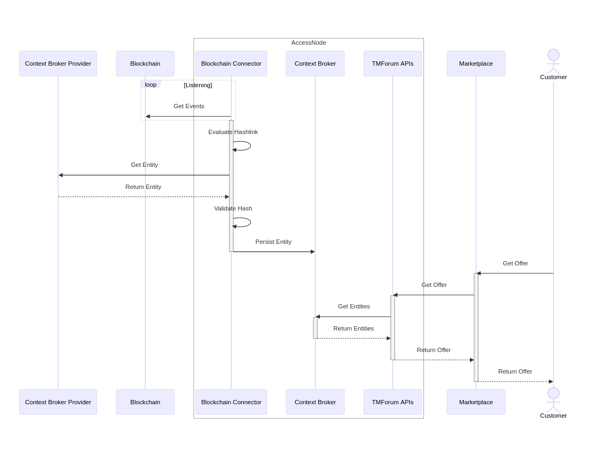

Figure 2.4-2 - Data flow inside access node (offering consumption)

Similar to the previous diagram, 2 sub-flows are required to provide the
offer to a customer at a different Marketplace Instance:

1.  The Blockchain Connector listens for events at the Blockchain.

2.  Once it receives an event, it evaluates the Hashlink.

3.  Retrieves the corresponding event from its Origin (the Context
    Broker of the provider).

4.  The Blockchain Connector validates the hash.

5.  It persists the entity at its local Context Broker.

In the second part, a customer tries to retrieve the offer from the
Marketplace:

1.  The Customer requests the Offer at the Marketplace.

2.  Marketplace requests the Offer at the TMForum APIs.

3.  TMForum APIs retrieve the entity from the local Context Broker.

4.  The offer is returned to the Customer.

# 3. TM Forum APIs

## 3.1. Introduction

TM Forum Open APIs are a set of standardized interfaces developed by
[<u>TM Forum</u>](https://www.tmforum.org/oda/open-apis/directory).
These APIs are designed to facilitate interoperability and seamless
communication between different systems and applications.

In the DOME Marketplace, we use the underlying data model as a common
data model for different Marketplace instances. The TM Forum Open APIs
are used to provide the DOME APIs as a standardized API for Marketplace
instances to connect to.

DOME implements a subset of the APIs described in the TM Forum [<u>Open
API Directory</u>](https://www.tmforum.org/oda/open-apis/directory).
That subset is described in this document, including the specific
features that DOME implements.

The document [<u>TMF630 REST API Design Guidelines
4.2.0</u>](https://www.tmforum.org/resources/standard/tmf630-rest-api-design-guidelines-4-2-0/)
provides guidelines and design patterns used in developing TM Forum REST
APIs, which are followed by the DOME implementation. In addition, each
family of REST APIs are described in detail in each related document
available in the TM Forum website.

However, the standard does not describe some details, which are left to
the implementers. This document describes the general use of the TM
Forum APIs by DOME and also the specific features implemented by DOME.
This includes some extensions which make use of the extension mechanism
in TM Forum APIs.

## 3.2. Basic Concepts

### 3.2.1. Main Entities

There are two types of organisations interacting in the marketplace: the
**Provider** and the **Customer**. Both are a type of **Party**, which
is a generic entity enabling the description of individuals (natural
persons) or organisations that have any kind of relationship with the
DOME Marketplace. Management of the Parties is described in [<u>3.15.
Party Management API</u>](#tmf632---party-management).

In order to sell products or services the Provider has to publish in the
DOME Marketplace one or more instances of a **Product Offering**, which
is essentially the thing that the **Customer** can contract. The
Customer must place a **Product Order** for a given **Product Offering**
in order to be able to use the actual **Product** described in the
**Product Offering**.

To facilitate management of Product Offerings, the Provider can group
the individual offerings in one (or more) **Product Catalog**, which is
a collection of **Product Offerings** intended for a set of specific
**Distribution Channels** and **Market Segments**. In addition, to
facilitate discovery of Product Offerings by the potential Customers,
DOME Marketplace makes available to Providers a set of **Categories**
which the Provider can assign to each Product Offering.

Management of the **Product Catalog** and related entities is described
in [<u>3.3. Product Catalog Management
API</u>](#tmf620---product-catalog-management).

When a **Customer** places a **Product Order** and is successfully
completed, a new **Product** instance is created in the **Product
Inventory**. Completing the procurement process implies the provisioning
of the Product, which is realized as the instantiation of a combination
of **Services** and/or **Resources** in a **Service Inventory** and a
**Resource Inventory**, respectively.

Focusing again in the Product Offering, it comprises the **Product
Specification**, the **Agreement** that governs usage of derived
products, the associated **Product Offering Price**, the market segment
it is targeted to, and other aspects which characterize each of the
products created when the Product Offering is procured. The Product
Specification, in turn, includes references to the specification of
services and/or resources required to realize the Products linked to
that Product Specification (each **Service Specification** is made
available through a **Service Candidate** in the **Service Catalog**
while each **Resource Specification** is made available through a
**Resource Candidate** in a **Resource Catalog**, respectively). There
may be one or more Product Offerings around the same Product
Specification (e.g., associated with different prices or targeted to
different market segments).

Each time a Product, Resource or Service is used, a **Usage** entity is
created, which typically is used to calculate how much can be charged to
consumers and paid to providers.

Figure 3.1.1-1 - TMForum main entities

### 3.2.2. Common properties of entities defined in TM Forum APIs

The following properties are common to all entities in the information
model underlying TM Forum APIs:

**id**: REQUIRED.

The unique identifier of the entity. In DOME we use a [<u>Uniform
Resource Name
(URN)</u>](https://en.wikipedia.org/wiki/Uniform_Resource_Name) for
the **id** property.
An example is:
“*urn:ngsi-ld:product-offering:15ce4f80-89f8-4c75-a0f5-d7d58a1c55c8*”.
The recompulsory format for DOME is:
id = urn:ngsi-ld:{TMF resource in Kebab-case}:{unique identifier}
The TMF resource name is specified in the description of each
resource.

**href**: REQUIRED

> The URI of the resource, as a relative path pointing to the resource.
> The **href** does not include the schema or the host. An example is
> the following **href** for a Product Specification:
>
> */tmf-api/catalog/v4/productSpecification/urn:ngsi-ld:product-specification:8a0a8a8a-5600-48a1-ac0f-80bba0806fba*
>
> The general format is the following (where we assume we use version 4
> of the APIs):
>
> href = /{management system}/v4/{resource name}/{unique identifier}
>
> Where ‘management system’ is defined in each chapter, and examples are
> *productCatalogManagement*, *agreementManagement*, *productInventory*,
> etc.
>
> Resource name is the specific name for the resource, for example
> *productOffering*, *productSpecification*, *catalog*, *category*,
> *customer*, etc.
>
> The **href** includes at the end the value of the **id** attribute of
> the object.
>
> The **href** of an object can be used to construct a complete REST URI
> which can be used to retrieve the object (if access control in the
> server allows it):
>
> URI = https://{domain\[:port\]}{href}
>
> So, an example URI for retrieving a Product Specification from the
> DOME Operator instance would be:
>
> https://tmf.dome-marketplace.eu/tmf-api/v4/catalog/productSpecification/urn:ngsi-ld:product-specification:8a0a8a8a-5600-48a1-ac0f-80bba0806fba

**version**: REQUIRED.

> Version of the concrete instance of the entity. This attribute is
> compulsory in DOME, even if it is not in the standard TMForum.
>
> **IMPORTANT**: some objects in DOME (notably the **Product Offering**
> and related entities) are **immutable** once they are launched and
> made public in the marketplace.
>
> That means that the object can NOT be modified and a new instance with
> a new version MUST be created.
>
> This is important because a **Customer** may have contracted a given
> version of a **Product Offering**, which includes a set of contractual
> properties that can not be changed unilaterally by the **Provider**.
> In other words, a **Product Order** is for a given version of a
> **Product Offering**, the one that was public at the time when the
> **Customer** made the purchase.
>
> To facilitate natural evolution of a **Product Offering**, a Provider
> can create new versions of it. The DOME Marketplace displays the
> instance of **Product Offering** with the latest version attribute (in
> lexicographic order), so new Customers can see only the latest version
> and will contract that version. New **Product Orders** will refer to
> the latest version of the **Product Offering** at the time when the
> order is placed and completed.
>
> It is recommended that **ALL** TMForum objects in DOME are treated as
> **immutable** once they are in the **Launched** or **Active** state,
> to avoid any legal implication regarding modifications for existing
> customers.

**lastUpdate**: REQUIRED.

> Date and time of the last update of the entity. An example is the
> following:
>
> *“lastUpdate”: “2020-08-27T00:00:00Z”*
>
> This attribute is required for all objects in DOME, even if it is not
> required by TM Forum.
>
> This attribute (together with **version** and some others) is used by
> the replication engine in DOME, to make sure that replication is
> efficient and every node in the ecosystem has the latest copy of the
> object.

**relatedParty**: REQUIRED.

> In DOME, every object has a relatedParty subresource object which is a
> relatedPartyRef ( a reference to the actual object with the Related
> Party data), even if it is not required in the standard. This object
> is critical for Access Control, and includes related parties and its
> roles. These are additional to whatever related parties the standard
> functionality of the object requires.
>
> In the standard, some objects do not have the relatedParty
> sub-resource in their definitions. For those objects, DOME makes use
> of the extension mechanism in TM Forum APIs, using the
> **@schemaLocation** attribute. The **@schemaLocation** is available at
> this URL:
>
> [<u>https://raw.githubusercontent.com/DOME-Marketplace/dome-odrl-profile/refs/heads/main/schemas/simplified/RelatedPartyRef.schema.json</u>](https://raw.githubusercontent.com/DOME-Marketplace/dome-odrl-profile/refs/heads/main/schemas/simplified/RelatedPartyRef.schema.json)
> and at this moment (Jun 14 2025) has the following content:

{

“\$schema”: “http://json-schema.org/draft-07/schema#”,

“\$id”: “\#RelatedPartyRef”,

“title”: “RelatedPartyRef”,

“description”: “This reference contains a list of related party
references.”,

“type”: “object”,

“properties”: {

“relatedParty”: {

“type”: “array”,

“description”: “List of references to related parties.”,

“items”: {

“required”: \[

“id”,

“href”

\],

“type”: “object”,

“properties”: {

“id”: {

“type”: “string”,

“description”: “Unique identifier of a related entity.”

},

“did”: {

“type”: “string”,

“description”: “eIDAS identifier of a related entity in did:elsi
format.”

},

“href”: {

“type”: “string”,

“description”: “Reference of the related entity.”

},

“name”: {

“type”: “string”,

“description”: “Name of the related entity.”

},

“role”: {

“type”: “string”,

“description”: “Role played by the related party”

},

“@baseType”: {

“type”: “string”,

“description”: “When sub-classing, this defines the super-class”

},

“@schemaLocation”: {

“type”: “string”,

“description”: “A URI to a JSON-Schema file that defines additional
attributes and relationships”,

“format”: “uri”

},

“@type”: {

“type”: “string”,

“description”: “When sub-classing, this defines the sub-class entity
name”

},

“@referredType”: {

“type”: “string”,

“description”: “The actual type of the target instance when needed for
disambiguation.”

}

}

}

}

}

}



> The relatedParty array can include many related parties, but the
> minimum ones in DOME are:
>
> **Seller**: REQUIRED. A related party with role ‘Seller’, for those
> objects related to a provider of products/services. For example, a
> Product Offering has the Seller attribute set to the CSP that owns the
> offering. A Product Order has the Seller attribute set to the CSP that
> owns the related Product Offering.
>
> **Buyer**: REQUIRED for objects related to a Customer. For example, a
> Product Order has the Buyer attribute set to the organisation that
> purchases the Product Offering, and will make the payment for it. Many
> objects do not have the Buyer attribute, for example the Product
> Offering.
>
> **SellerOperator**: REQUIRED. Identifies the organisation that
> operates the machine that manages the objects on behalf of the
> provider. It is equal to the Seller attribute if the provider is the
> operator. Some examples:

- If a Product Offering has been created by a CSP using the user
  interface of the DOME Marketplace, the SellerOperator attribute of the
  Product Offering identifies the DOME Operator (the DOME Foundation in
  this case). The Seller attribute identifies the CSP.

- If a Product offering has been created by a CSP in an Access Node
  operated by itself (the CSP), then both Seller and SellerOperator
  identify the CSP.

- If a Product Offering has been created by a CSP in a Federated
  Marketplace, the Seller attribute identifies the CSP, and the
  SellerOperator identifies the Federated Marketplace organization.

> **BuyerOperator**: REQUIRED for all objects related to a customer
> (like a Product Order). The same considerations apply as for the
> SellerOperator attribute, where this attribute identifies the
> organisation operating or managing the server on behalf of the
> Customer

**@type**: id identifying the type of the entity.

**@baseType**: id of the type which the type identified with @type
extends (equals @type if @type is a root type, i.e., does not extend any
other type).

**@schemaLocation**: URL of the schema associated with the type. This
can be used for extending the object, as is done by DOME.

**validFor**: the time period during which the given entity is valid

### 3.2.3. Lifecycle Status

Some entities (e.g., Catalog) may have a Lifecycle Status property which
describes where it is within a well defined commercialization lifecycle.

In DOME, all objects in status Launched or later are **immutable** and
MUST include a **version** attribute which is incremented in ascending
lexicographic order.

Figure 3.1.3-1 - Entity lifecycle status

## 3.3. Access Control to TMForum APIs

Access Control to the APIs is provided in DOME by a technical layer on
top of the basic implementation of the TM Forum APIs. This layer
implements both a [<u>Policy Enforcement Point
(PEP)</u>](https://csrc.nist.gov/glossary/term/policy_enforcement_point)
and a [<u>Policy Decision Point
(PDP)</u>](https://csrc.nist.gov/glossary/term/policy_decision_point).
For simplicity, in the following we will use the term “DOMEPDP” to refer
to this layer. The DOMEPDP allows the definition and enforcement of
arbitrary policy rules, but we describe here the essential rules which
are critical for the correct functioning of the DOME ecosystem. These
rules require close cooperation between the access control layer and the
APIs, so it is better to describe them in a single place.

### **Access Control to the APIs use the LEARCredentialMachine**

This is a Verifiable Credential that is issued to a machine (we use here
the word “machine” as a simplification, because the credential is in
reality issued to a “workload”, in the terms of SPIFFE) operated by an
organization which has already performed the onboarding process in DOME.
The LEARCredentialMachine embeds inside the following information:

- The identification of the legal entity operating the machine/workload,
  corresponding to the real identity of the organization under the eIDAS
  legal framework. The format used the did:elsi format.

- A public key which is uniquely assigned to the machine/workload during
  the generation of the LEARCredentialMachine. The corresponding private
  key is only known to the organization operating the machine/workload,
  and is used to sign during the OAuth flows leading to getting an
  access token.

When acting as a PEP, the DOMEPDP intercepts all calls to the TMForum
APIs coming from sources external to the DOME Instance.
Machine-to-Machine (M2M) authentication in DOME uses OAuth 2.0 where the
authorization server issues access tokens in exchange for
LEARCredentialMachine Verifiable Credentials.That is, the
application/workload uses the token endpoint of the authorization server
in DOME to obtain the access token used in the calls to the TMForum
APIs.

### Access Control to the APIs use information of the object being accessed.

For many APIs, we need to perform access control based on information
inside the object that is being accessed. This means the DOMEPDP has to
“introspect” the TMF object before giving access to the external
application.

The most important attributes inside the objects used for access control
are in the *relatedParty* array which in DOME is compulsory for all
objects, except Category, Organization and Individual. An example of
this relatedParty object is the following:

“relatedParty”: \[

{

“href”: “urn:ngsi-ld:party:221f6434-ec82-4c62”,

“id”: “urn:ngsi-ld:party:221f6434-ec82-4c62”,

**“name”: “did:elsi:VATES-11111111”**,

**“role”: “Seller”**,

“@referredType”: “Organization”

},

{

“href”: “urn:ngsi-ld:party:221f6434-ec82-4c62”,

“id”: “urn:ngsi-ld:party:221f6434-ec82-4c62”,

**“name”: “did:elsi:VATES-22222222”**,

**“role”: “SellerOperator”**,

“@referredType”: “Organization”

},

{

“href”: “urn:ngsi-ld:party:221f6434-ec82-4c62”,

“id”: “urn:ngsi-ld:party:221f6434-ec82-4c62”,

**“name”: “did:elsi:VATES-33333333”**,

**“role”: “Buyer”**,

“@referredType”: “Organization”

},

{

“href”: “urn:ngsi-ld:party:221f6434-ec82-4c62”,

“id”: “urn:ngsi-ld:party:221f6434-ec82-4c62”,

**“name”: “did:elsi:VATES-44444444”**,

**“role”: “BuyerOperator”**,

“@referredType”: “Organization”

}

\]



### User-defined policies

The DOMEPDP component allows the user to define the policies, using
[<u>Starlark</u>](https://starlark-lang.org/), a simplified dialect of
Python.

The DOMEPDP analyzes the incoming request, the object being accessed and
provides to the user defining the policies the most relevant attributes
so the policies can use those attributes.

The user defining policies has access to an object called ‘**input**’
which contains four objects that can be used to implement the
authorization policies: ‘**request**’, ‘**token**’, ‘**user**’ and
‘**tmf**’:

“**request**” is an object with the following fields representing the
HTTP request received:

- “**action**”: one of ‘LIST’, ‘READ’, ‘CREATE’, ‘UPDATE’ or ‘DELETE’,
  which is an alias of the HTTP method of the request.

- “**method**”: the HTTP method that was used in the request (‘GET’,
  ‘POST’, ‘PUT’, ‘PATCH’ or ‘DELETE’).

- “**host**”: the host header in the request.

- “**remote_addr**”: the IP address of the remote machine accessing the
  object.

- “**path**”: the url path (does not include the query parameters).

- “**query**”: a dictionary with all the query parameters in the url.

- “**resource**”: the TMForum resource being accessed (eg.,
  productOffering, catalog, etc.).

- “**id**”: the identifier of the TMForum object being accessed.

- “**headers**”: a dictionary with the headers in the HTTP request.

“**token**” is an object with the contents of the Access Token received
with the request. The most important object inside the ‘token’ object is
the LEARCredential, accessed via the ‘vc’ property of ‘token’.

The Access Token has already been formally verified, including that the
signature is valid, so it can be trusted by the policy definition.

- “**vc**”: contains the LEARCredential presented by the caller. The
  most important sub-objects in ‘vc’ are the **‘mandator’**,
  **‘mandatee’** and **‘powers’**, which can be used by the ‘authorize’
  function to implement the policies.

“**user**” is an object with some properties extracted from the token to
facilitate writing rules. It is just a convenience object and the rules
can always access the token if needed.

- “**isAuthenticated**” is boolean which is True if the request came
  with a valid access token.

- “**organizationIdentifier**” is the identifier for the mandator.

- “**isLEAR**” is a boolean which is True if the user has the
  “Onboarding” power.

- “**isOwner**” is a boolean which is True if the TMF object is owned by
  the organization of the user.

- “**country**” is the two letter code for the country of incorporation
  of the organization.

- “**isSeller**”, “**isBuyer**”, “**isSellerOperator**” and
  “**isBuyerOperator**” are booleans reporting if the calling user has
  that role in the TMF object being accessed

“**tmf**” has the contents of the TMForum object that the remote user
tries to access. The policies can access any component of the object,
but to simplify writing policy rules, the system makes available some
calculated fist level sub-objects inside the ‘tmf’ object:

- “**resource**”: the resource name of the TMForum object being
  accessed, like **‘productOffering’** or ‘productSpecification’.

- “**organizationIdentifier**”: the identifier of the company who owns
  the TMForum object, which is the company that created the object in
  the DOME Marketplace.

- “**permittedCountries**” and “prohibitedCountries” which are lists of
  countries according to the country restriction policies embedded in
  the TMForum object.

- “**permittedOperators**” and “prohibitedOperators” which are lists of
  operator identities according to the operator restriction policies
  embedded in the TMForum object.

To illustrate how to write policies, below is a simple example:

# These are just examples of policies that you can use to define yours.

\# You can add and delete anything that you need for implementing your
policies.

\# The only thing you can not change is the name of the function,

\# which must be ‘authorize’.

def authorize():

\# Check if the user is authenticated

if input.user.isAuthenticated:

\# The ‘print’ function writes to the logging system

print(“user:”, input.user.organizationIdentifier, “Is LEAR?”,
input.user.isLEAR)

else:

print(“user is not authenticated”)

return False

\# This rule denies access to remote users belonging to an

\# organization in the list of forbidden countries

if input.user.country in forbidden_countries:

print(“rejected because country forbidden:”, input.user.country)

return False

\# This rule denies access to remote users not explicitly included

\# in the allowed countries list

if input.user.country not in allowed_countries:

print(“forbidden because country not allowed:”, input.user.country)

return False

\# You can take different decisions depending on the action that the

\# user is intending to do

if input.request.action == “UPDATE”:

return True

\# This denies access to all requests that have not been rejected or

\#accepted by the previous rules.

\# The default is to deny access, so if you do not explicitly return
True

\# at some point, the request will be rejected.

return False

\#
\*\*\*\*\*\*\*\*\*\*\*\*\*\*\*\*\*\*\*\*\*\*\*\*\*\*\*\*\*\*\*\*\*\*\*\*\*\*\*\*\*\*\*\*\*\*\*\*\*\*\*\*\*\*\*\*\*\*\*\*\*\*\*\*\*\*\*\*\*

\# The previous statement (‘return’) stops evaluation of rules.

\# The rules below are additional examples of fields available for
rules.

\# They are not executed but you can copy/paste and adapt.

\#
\*\*\*\*\*\*\*\*\*\*\*\*\*\*\*\*\*\*\*\*\*\*\*\*\*\*\*\*\*\*\*\*\*\*\*\*\*\*\*\*\*\*\*\*\*\*\*\*\*\*\*\*\*\*\*\*\*\*\*\*\*\*\*\*\*\*\*\*\*

\# This rule denies access if the organization of the remote user is not

\# the same as the one owning the TMForum object

if not input.user.isOwner:

return False

\# You can also access the powers of the remote user,

\# available in the LEARCredential.

\# You can use variables to facilitate writing the rules. For example:

mandator = input.token.vc.credentialSubject.mandate.mandator

mandatee = input.token.vc.credentialSubject.mandate.mandatee

powers = input.token.vc.credentialSubject.mandate.power

remote_user_organization = mandator.organizationIdentifier

\# An alternative syntax is available if you are more comfortable with
it

credential_subject = input\[“token”\]\[“vc”\]\[“credentialSubject”\]

also_the_mandator = credential_subject\[“mandate”\]\[“mandator”\]

also_the_user_organization =
also_the_mandator\[“organizationIdentifier”\]

\# This is just in case we reach here for some reason

return False



### Essential policies

The access control rules here should be the very same that the BAE
enforces for customers and providers.

For each of the relevant root TMF types, the rules are the following:

- **General**:

  - There are some fields (e.g. id) that can’t be changed once an object
    has been created.

  - There are maybe some fields that it only makes sense to be set at
    creation time and can’t be changed later.

  - All other fields can be changed by some role (e.g. buyer and/or
    seller). These are described below.

#### TMF620 Product Catalog Management

- **TMF620 ProductOffering, ProductSpecification, Catalog and others
  related to the publishing of product offerings, except Category.**

> Category objects can only be created, updated or deleted by the DOME
> Foundation. For the other objects in this management system, the
> operations are:

- Create: Any authenticated user with the power Create-ProductOffering
  can create the object. The Seller attribute is set to the did of the
  authenticated user, and SellerOperator is set to the did of DOME
  Foundation (or the did of the entity operating the marketplace).

- Update: The authenticated user must have the power
  Update-ProductOffering. The did of the user must be equal to the
  Seller attribute of the object being updated. The SellerOperator
  attribute of the entity being modified must be the did of the DOME
  Foundation.

- Delete: The authenticated user must have the power
  Delete-ProductOffering. The did of the user must be equal to the
  Seller attribute of the object being updated. The SellerOperator
  attribute of the entity being modified must be the did of the DOME
  Foundation.

- Everybody can view the objects (but according to the visibility
  policy, if any, within the offering itself)

#### TMF632 Party Management

- **TMF632 Organization** This entity is special. It is automatically
  created as part of the on boarding process. It is created by the DOME
  Foundation on behalf of the organization when a user belonging to that
  organization logins for the first time in the DOME Marketplace.

  - Create/Delete: Only the DOME Foundation can create Organization
    objects. The Organization does not have Seller or SellerOperator
    related parties.

  - Update: Only the Provider can update the information fields,
    organization ID fields such as its trading name are taken from the
    organization credentials

  - Everybody else can view

- **TMF632 Individual** (This is not transaction-related, but including
  it for completeness. This entity is automatically created the first
  time an individual accesses the system on behalf of an organization).

  - Only the Individual can update

  - Everybody else can view

- **TMF622 ProductOrders** (Created by Buyer, usually via marketplace.
  Hosted by marketplace AN who also set the BuyerOperator field).

  - Only Buyers can create orders

  - Providers can only change these fields:

    - Notes: Providers can update the notes for adding extra information
      for the provider

    - State: Providers can update the state of their product order items
      for handling manual procurement (product order state is
      automatically managed)

  - Buyers can only change:

    - Notes: Buyers can use notes to add extra information for the
      provider

  - Only Buyer and Seller can view (all fields).

  - Everybody else has no access

- **TMF648 Quote (**Created by Buyer, usually via marketplace. Hosted by
  marketplace AN who also set the BuyerOperator field)

  - Only Buyers can create Quotes

  - Providers can only change these fields:

    - …

  - Buyers can only change:

    - …

  - Only Buyer and Seller can view (all fields).

  - Everybody else has no access

- **TMF637 Products** (Created by Seller via marketplace or via APIs.
  Hosted by provider AN or marketplace AN)

  - Only Seller or SellerOperator can create/update products. On
    creation, the Seller or SellerOperator has to set the relatedParty
    sub-resource with the Seller, Buyer, SellerOperator and
    BuyerOperator entries. In the case that the Seller is also the
    SellerOperator, both entries have to be set to identify the Seller.

  - Only Buyer and Seller can view (all fields)

  - Everybody else has no access

- TMF678 **AppliedCustomerBillRates** (Created by the DOME billing
  subsystem or by a seller billing subsystem, or by the BAE. Hosted by:
  DOME AN or seller AN)

  - Only Seller can create/update bills

  - Billing/invoicing engine can also create/update bills. This engine
    has to be operated by the SellerOperator.

  - On creation, the Seller or SellerOperator has to set the
    relatedParty sub-resource with the Seller, Buyer, SellerOperator and
    BuyerOperator entries. In the case that the Seller is also the
    SellerOperator, both entries have to be set to identify the Seller.

  - Only Buyer and Seller can view (all fields)

  - Everybody else has no access

  - API now supports removal of applied customer bill rates entities.

- TMF678 **CustomerBills** (Created by the DOME billing subsystem or by
  a seller billing subsystem. Hosted by: DOME AN or seller AN)

  - Only Seller can create/update customer bills

  - Billing/invoicing engine also can create/update customer bills

  - Only Buyer and Seller can view (all fields)

  - Everybody else has no access

  - API now supports removal of customer bills as well as the update of
    billNo, amountDue, appliedPayment and remainingAmount

- TMF635 **Usage** (Created by the seller monitoring subsystem. Hosted
  by: seller AN)

  - Only Seller can create/update usage documents

  - Only Buyer and Seller can view (all fields)

  - Everybody else has no access

## 3.4. TMF620 - Product Catalog Management

The details are in the [<u>TM Forum API User Guide for Product Catalog
Management API
v4</u>](https://www.tmforum.org/oda/open-apis/directory/product-catalog-management-api-TMF620/v4.1).
We describe here an overview and the relevant DOME characteristics.

The catalog management API allows the management of the entire lifecycle
of elements in a catalog and the consultation of catalog elements during
several processes such as ordering process, campaign management or sales
management.

The name of the management system for the URI is
productCatalogManagement and the resources managed in this family of
APIs are the following:

- **category**

- **catalog**

- **productOffering**

- **productOfferingPrice**

- **productSpecification**

The base paths for the external access to the APIs in the DOME instance
are then:

https://tmf.dome-marketplace.eu/tmf-api/productCatalogManagement/v4/productOffering

https://tmf.dome-marketplace.eu/tmf-api/productCatalogManagement/v4/productSpecification

https://tmf.dome-marketplace.eu/tmf-api/productCatalogManagement/v4/productOfferingPrice

https://tmf.dome-marketplace.eu/tmf-api/productCatalogManagement/v4/catalog

https://tmf.dome-marketplace.eu/tmf-api/productCatalogManagement/v4/category

### 3.4.1. Product Catalog

A **Product Catalog** is a collection of **Product Offerings** intended
for a specific **Distribution Channel** and **Market Segment.**

Properties of a **Catalog**:

- **version**: Product Catalog version

- **lastUpdate**: Date and time of the last update.

- **validFor**: The time period for which the Product Catalog is valid.

- **lifecycleStatus**: Indicates the [<u>lifecycle
  status</u>](https://docs.google.com/document/d/1ePSb3OammKcsnMgHNgp5ZdH7pif4oT5gUtsBNUR1ikc/edit#heading=h.630t0iqrupp8)
  of the Product Catalog.

- **name**: Name given to the catalog

- **description**: A narrative that explains in detail the catalog.

- **catalogType**: Whether the catalog includes products, services or
  resources

- **category**: List of category references (Points to category objects
  as defined in this API)

- **relatedParty**: List of parties related to the catalog. The parties
  should be valid parties registered in the Party Management API

  - id: Id of the Party in party management API

  - href: Reference of the party pointing to a Party resources as
    specified in the Party Management API

  - role: Role the party is playing in the related catalog (free
    string).

### 3.4.2. Category

The category resource is used to group product offerings, service and
resource candidates. Categories can contain other categories and/or
product offerings, resources or service candidates.

Properties of a **Category**:

- **version**: Category version

- **lastUpdate**: Date and time of the last update.

- **validFor**: The time period for which the Category is valid.

- **lifecycleStatus**: Indicates the [<u>lifecycle
  status</u>](https://docs.google.com/document/d/1ePSb3OammKcsnMgHNgp5ZdH7pif4oT5gUtsBNUR1ikc/edit#heading=h.630t0iqrupp8)
  of the Category.

- **name**: Name given to the catalog

- **description**: A narrative that explains in detail the category.

- **isRoot**: Whether the category is a root category or not.

- **parentID**: Id of the parent category of the category is not root

- **subCategory**: List of category references pointing to the child
  categories

- **productOffering**: List of references pointing to Product Offerings
  that are included in this category (see description of Product
  offering objects as defined in this API). Product offerings that are
  included in this category.

Figure 3.2.2-1 - Catalog

### 3.4.3. Product Offering

Represents offerings on products that are orderable from the provider of
the catalog. It includes specification of the products, pricing
information and other characteristics of the Product that gets created
when a Product Offering is procured (.

Properties of a **Product Offering**:

- **version**: Product offering version

- **lastUpdate**: Date and time of the last update.

- **validFor**: The time period for which the product offering is valid.

- **lifecycleStatus**: Indicates the [<u>lifecycle
  status</u>](https://docs.google.com/document/d/1ePSb3OammKcsnMgHNgp5ZdH7pif4oT5gUtsBNUR1ikc/edit#heading=h.630t0iqrupp8)
  of the product offering.

- **StatusReason**: A string providing complementary information on the
  value of the lifecycle status attribute.

- **name**: Name of the product offering.

- **description**: A narrative that explains in detail what the product
  offering is.

- **attachment**: A list of attachment references or values. Complements
  the description of an element (for instance a product) through video,
  pictures, etc.

- **category**: List of Category references pointing to categories that
  apply to the product offering

- **place**: A list of references to places where products linked to
  this product offering are sold or delivered.

- **channel**: A list of references to channels through which the
  product offering is being sold.

- **marketSegment**: A list of market segment references. provides
  references to the corresponding market segment as target of product
  offerings. A market segment is grouping of Parties, GeographicAreas,
  SalesChannels, and so forth.

- **agreement**: A list of agreement references. Agreements are defined
  in the Agreement Management API. An agreement represents a contract or
  arrangement, either written or verbal and sometimes enforceable by
  law, such as a service level agreement or a customer price agreement.
  An agreement involves a number of other business entities, such as
  products, services, and resources and/or their specifications

- **isBundle**: Whether the product offering is a bundle product
  offering or not.

- **bundledProductOffering**: List of product offering references
  pointing to the product offerings included in the bundle, if the
  product offering is a bundle.

- **isSellable**: If false the offering only can be sold within a
  bundle. Therefore it is true when can be sold stand-alone.

- **ProductSpecification**: Reference to the product specification to
  which the product offering is related.

- **ProdSpecCharValueUse**: Includes the list of product specification
  characteristic values that are valid in the context of the product
  offering.

- **ProductOfferingPrice**: List of references to Product Offering
  Prices that apply to the product offering. The price is valid for a
  defined period of time and may not represent the actual price paid by
  a customer.

- **productOfferingTerm**: A list of references to Product Offering
  Terms, each of which refers to a condition under which the product
  offering is made available to customers, such as the commitment
  period. Each term comprises:

  - name

  - description

  - duration: length of time associated to the term

  - validFor: period of dates during which the term may apply

- **ProductOfferingRelationship**: A list of product offering
  relationships. A relationship between this product offering and other
  product offerings.

- **ResourceCandidate**: List of references to ResourceCandidates as
  defined in Resource Catalog API. Resource Candidates make Resource
  Specifications available for inclusion in Product Offerings.

- **ServiceCandidate**: List of references to ServiceCandidates as
  defined in the Service Catalog API. Service Candidates make Service
  Specification available for inclusion in Product Offerings.

- **Agreement**: Reference to a service level agreement. A service level
  agreement (SLA) is a type of agreement that represents a formal
  negotiated agreement between two parties designed to create a common
  understanding about products, services, priorities, responsibilities,
  and so forth. The SLA is a set of appropriate procedures and targets
  formally or informally agreed between parties in order to achieve and
  maintain specified Quality of Service.

Figure 3.2.3-1 - Product offering

### 3.4.4. Product Specification

Is a detailed description of some of the attributes that will
characterize Products created when a Product Offering is successfully
ordered (procured).

Properties of a **Product Specification**:

- **version**: Product specification version

- **lastUpdate**: Date and time of the last update.

- **validFor**: The time period for which the product specification is
  valid.

- **lifecycleStatus**: Indicates the [lifecycle
  status](https://docs.google.com/document/d/1ePSb3OammKcsnMgHNgp5ZdH7pif4oT5gUtsBNUR1ikc/edit#heading=h.3yt1a5h9wjkw)
  of the product specification.

- **name**: Name of the product specification.

- **productNumber**: An identification number assigned to identify the
  product specification.

- **brand**: The manufacturer or trademark of the product specification

- **description**: A narrative that explains in detail what the product
  specification is.

- **attachment**: List of attachments that complements the description
  of the product (i.e doc a video, etc)

- **isBundle**: Whether the product specification defines a product
  bundle

- **bundledProductSpecification**: If the product is a bundle,
  references to the list of product specifications included in the
  bundle

- **productSpecCharacteristic**: A list of product specification
  characteristics. A characteristic quality or distinctive feature of a
  ProductSpecification. The characteristic can be take on a discrete
  value, such as color, can take on a range of values, (for example,
  sensitivity of 100-240 mV), or can be derived from a formula (for
  example, usage time (hrs) = 30 - talk time \*3). Certain
  characteristics, such as color, may be configured during the ordering
  or some other process.

- **productSpecificationRelationship**: List of Product Specification
  references. Examples are: migration, substitution, dependency or
  exclusivity relationships between/among product specifications.

- **relatedParty**: List of parties involved in the product
  specification as defined in the Party API, including the role the
  party has regarding the product specification.

- **resourceSpecification**: A list of Resource Specification
  references, where each Resource Specification is needed to realize the
  product specification. Resource Specification is defined in the
  Resource Catalog API.

- **serviceSpecification**: A list of Service Specification references,
  where each Service Specification is needed to realize the product
  specification. Service Specification is defined in the Service Catalog
  API.

- **targetProductSchema**: The reference object to the schema and type
  of target product which is described by product specification.

>  style="width:6.26772in;height:6.31944in" />

Figure 3.2.4-1 - Product specification

### 3.4.5. Product Offering Price

Refers to a pricing model associated with a Product Offering. There may
be multiple Product Offering Prices associated with a Product Offering
(see description of Product Offering).

Properties of a **Product Offering Price**:

- **version**: Product offering price version

- **lastUpdate**: Date and time of the last update.

- **validFor**: The time period for which the product offering price is
  valid.

- **lifecycleStatus**: Indicates the [<u>lifecycle
  status</u>](https://docs.google.com/document/d/1ePSb3OammKcsnMgHNgp5ZdH7pif4oT5gUtsBNUR1ikc/edit#heading=h.630t0iqrupp8)
  of the product offering price.

- **name**: Name given to the product offering price.

- **description**: A narrative that explains in detail what the product
  offering price is.

- **place**: A list of references to places where products with this
  product offering price are sold or delivered.

- **price**: The amount of money that characterizes the price.

- **priceType**: A category that describes the price, such as recurring,
  discount, allowance, penalty, and so forth.

- **pricingLogicAlgorithm**: It represents an instantiation of an
  interface specification to external rating function. Some of the
  parameters of the interface definition may be already set (such as
  price per unit) and some may be gathered during the rating process
  from the event (such as call duration) or from
  ProductCharacteristicValues (such as assigned bandwidth).

- **recurringChargePeriodLength**: The period of the recurring charge:
  1, 2, … .It is set to zero if it is not applicable.

- **recurringChargePeriodType**: The period to repeat the application of
  the price Could be month, week…

- **tax**: An amount of money levied on the price of a Product by a
  legislative body.

- **unitOfMeasure**: A number and unit representing how many (for
  instance 1 dozen) of a ProductOffering is available at the offered
  price. Its meaning depends on the priceType. It could be a price, a
  rate, or a discount.

- **productOfferingTerm**: A list of reference to Product Offering Terms
  (see Product Offerings), that is conditions, under which the
  ProductOfferingPrice is made available to Customers. For instance, a
  Product Offering Price can be offered with multiple commitment
  periods.

- **isBundle**: Whether the product offering price is a bundle product
  offering price or not.

- **bundledPopRelationship**: this object represents a bundle
  relationship from a bundle product offering price (parent) to a simple
  product offering price (child). A simple product offering price may
  participate in more than one bundle relationship.

- **constraint**: a list of references to constraints, each of which
  represents a policy/rule applied to ProductOfferingPrice.

- **popRelationship**: A list of product offering prices related to this
  Product Offering Price, for example a price alteration such as
  allowance or discount.

- **prodSpecCharValueUse**: A use of the prodSpecCharValue by a
  ProductOfferingPrice to which additional properties (attributes) apply
  or override the properties of similar properties contained in
  ProductSpecificationCharacteristicValue. It should be noted that
  characteristics whose value(s) addressed by this object must exist in
  corresponding product specification. The available characteristic
  values for a ProductSpecificationCharacteristic in a Product
  specification can be modified at the ProductOffering and
  ProcuctOfferingPrice level. The list of values in
  ProductSpecificationCharacteristicValueUse is a strict subset of the
  list of values as defined in the corresponding product specification
  characteristics.

Figure 3.2.5-1 - Product offering price

## 3.5. TMF622 - Product Ordering Management

Provides a standardized mechanism for placing a product order with all
of the necessary order parameters. The API consists of a simple set of
operations that interact with CRM/Order negotiation systems in a
consistent manner. A product order is created based on a product
offering that is defined in a catalog. The product offering comprises
the specification of the product or bundle of products that will be
created when the offering is procured and includes characteristics such
as pricing, product options and target market.

### 3.5.1. Product Order

A **Product Order** is a type of order which can be used to place an
order between a **Party** (customer or other interested party) and a
service provider. It is connected to a **Product Offering** in the
**Product Catalog** and, when successfully completed, leads to creation
of a **Product** in the **Product Inventory**.

A product order has the following lifecycle:

Figure 3.3.1-1 - Product order lifecycle

The product order entity has the following attributes:

- **Agreement**: A list of references to agreements. Agreements defined
  in the context of the product order.

- **billingAccount**: A reference to a billing account of the customer

- **cancellationDate**: Date in which the order has been canceled (when
  cancelled).

- **cancellationReason**: Reason why the order is cancelled (when
  cancelled).

- **category**: Used to categorize the order from a business perspective
  that can be useful for the OM system (e.g. “enterprise”,
  “residential”, …)

- **channel**: A list of related channels. Related channel to another
  entity. May be online web, mobile app, social ,etc

- **completionDate**: Date when the order was completed.

- **expectedCompletionDate**: Expected completion date amended by the
  provider

- **externalId**: ID given by the consumer and only understandable by
  him (to facilitate his searches afterwards).

- **note**: A list of notes. Extra information about a given entity.

- **notificationContact**: Contact attached to the order to send back
  information regarding this order.

- **orderDate**: Date when the order was created.

- **orderTotalPrice**: An amount, usually of money, that represents the
  actual price paid by the Customer for this item or this order. Pricing
  model object of each of the items

- **payment**: A list of references to **Payment** resources, as defined
  in the Payment Management API

- **priority**: A way that can be used by consumers to prioritize orders
  in OM system (from 0 to 4 : 0 is the highest priority, and 4 the
  lowest)

- **productOfferingQualification**: A list of product offering
  qualification references (ProductOfferingQualificationRef \[\*\]).
  It’s a productOfferingQualification that has been executed previously

- **productOrderItem**: . An identified part of the order. A product
  order is decomposed into one or more order items. Product offerings
  included in the order and action to perform add, modify, delete,
  noChange.

- **quote**: A list of quote references as defined in Quote Management
  API.

- **relatedParty**: A list of related parties. A related party defines a
  party or party role linked to a specific entity. It includes the
  customer, provider and other parties that may be involved.

- **requestedCompletionDate**: Requested delivery date from the
  requestor perspective.

- **requestedStartDate**: Order fulfillment start date wished by the
  requestor. This is used when, for any reason, requestor cannot allow
  seller to begin to operationally begin the fulfillment before a date

- **State**: Lifecycle status of the order.

Figure 3.3.1-2 - Product order

## 3.6. TMF648 - Quote Management

TODO: complete.

### 3.6.1. Quote

Quote can be used to negotiate service and product acquisition or
modification between a customer and a service provider. Quote contain
list of quote items, a reference to customer (partyRole), a list of
productOffering and attached prices and conditions.

- **agreement:** A list of agreement references (AgreementRef \[\*\]). A
  reference to an agreement defining the context of the quote.

- **authorization:** A list of authorizations (Authorization \[\*\]). An
  authorization provided for the quote.

- **billingAccount:** A list of billing account references
  (BillingAccountRef \[\*\]). A reference to a billing account to
  provide quote context information.

- **category:** A string. Used to categorize the quote from a business
  perspective that can be useful for the CRM system (e.g. “enterprise”,
  “residential”, …).

- **contactMedium:** A list of contact mediums (ContactMedium \[\*\]).
  Information contact related to the quote requester.

- **description:** A string. Description of the quote.

- **effectiveQuoteCompletionDate:** A date time (DateTime). Date when
  the quote has been completed.

- **expectedFulfillmentStartDate:** A date time (DateTime). this is the
  date wished by the requester to have the requested quote item
  delivered.

- **expectedQuoteCompletionDate:** A date time (DateTime). This is
  expected date - from quote supplier - to be able to send back a
  response for this quote.

- **externalId:** A string. ID given by the consumer and only
  understandable by him (to facilitate his searches afterwards).

- **href:** A string. Hyperlink to access the quote.

- **id:** A string. Unique identifier - attributed by quoting system.

- **instantSyncQuote:** A boolean. An indicator which when the value is
  “true” means that requester expects to get quoting result immediately
  in the response. If the indicator is true then the response code of
  200 indicates the operation is successful otherwise a task is created
  with a response 201.

- **note:** A list of notes (Note \[\*\]). Free form text associated
  with the quote.

- **productOfferingQualification** A list of product offering
  qualification references (ProductOfferingQualificationRef \[\*\]). A
  reference to a previously done product offering qualification.

- **quoteDate:** A date time (DateTime). Date and time when the quote
  was created.

- **quoteItem:** A list of quote items (QuoteItem \[1..\*\]). An item of
  the quote - it is used to describe an operation on a product to be
  quoted.

- **quoteTotalPrice** A list of quote prices (QuotePrice \[\*\]). Quote
  total price.

- **relatedParty** A list of related parties (RelatedParty \[\*\]). A
  reference to a party playing a role in this quote (customer, seller,
  requester, etc.).

- **requestedQuoteCompletionDate** A date time (DateTime). This is
  requested date - from quote requester - to get a complete response for
  this quote.

- **state:** A quote state type (QuoteStateType). State of the quote :
  described in the state-machine diagram.

- **validFor:** A time period. Quote validity period.

- **version:** A string. Quote version - if the customer rejected the
  quote but negotiations still open a new version of the quote is
  managed.

The quote API defines the following cycle for its entities:

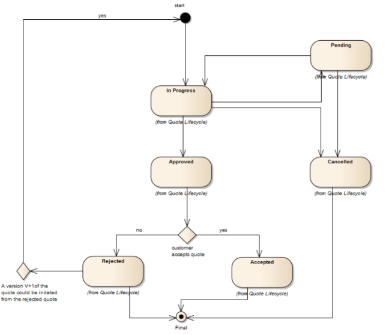

## 3.7. TMF637 - Product Inventory Management

The Product API provides a standardized mechanism to retrieve product
inventory information. The API consists of a simple set of operations
that interact with Inventory systems in a consistent manner. Usually, a
product is created and modified following a product order but could be
also ‘directly’ modified for administrative reasons.

### 3.7.1. Product

A product offering procured by a customer or other interested party
playing a party role. A product is realized as one or more service(s)
and / or resource(s).

The party role is a generalization of the customer role, so it is
possible to instantiate products, services and resources for parties
playing a custom party role as a result of the creation of an agreement
of any kind.

- **Name**: Name of the product. It could be the same as the name of the
  product offering.

- **Description**: Is the description of the product. It could be copied
  from the description of the Product Offering.

- **Agreement**: A list of agreement item references. An agreement
  represents a contract or arrangement, either written or verbal and
  sometimes enforceable by law, such as a service level agreement or a
  customer price agreement. An agreement involves a number of other
  business entities, such as products, services, and resources and/or
  their specifications. Agreement or agreement that triggers the
  instantiation of the product.

- **billingAccount**: Reference to the Billing Account of the customer
  as defined in the Account Management API.

- **isBundle**: Whether the acquired product is a bundle, it refers to
  the isBundle field of the productOffering.

- **isCustomerVisible**: Whether the product is visible to the customer

- **orderDate**: Date when the product was ordered

- **terminationDate**: Date when the product has been terminated (i.e
  the term is over)

- **place**: A related place defines a place described by reference or
  by value linked to a specific entity

- **productOrderItem**: List of related productOrder items as defined in
  the Product Ordering Management API. The product order item which
  triggered product creation/change/termination.

- **productCharacteristic**: List of product characteristics as selected
  by the customer

- **productPrice**: Pricing model applied to the product (i.e selected
  by the customer or other means)

- **productRelationship**: Linked products to the one instantiate, such
  as \[bundled\] if the product is a bundle and you want to describe the
  bundled products inside this bundle; \[reliesOn\] if the product needs
  another already owned product to rely on (e.g. an option on an already
  owned mobile access product) \[targets\] or \[isTargeted\] (depending
  on the way of expressing the link) for any other kind of links that
  may be useful

- **productSerialNumber**: Is the serial number for the product. This is
  typically applicable to tangible products e.g. Broadband Router.

- **productSpecification**: Reference to the acquired product
  specification

- **productOffering**: Reference to the acquired offering

- **productTerm**: Term applied to the product, taken from
  productOfferingTerm from product Offering

- **realizingResource**: List of references to Resources as defined in
  Resource Inventory API. Resources used in the product

- **realizingService**: List of references to services as defined by the
  Service Inventory API.

- **relatedParty**: A list of related parties, each of which defines
  party or party role linked to a specific entity.

- **startDate**: A date time (DateTime). Is the date from which the
  product starts.

- **status**: A product status type (ProductStatusType). Is the
  lifecycle status of the product.

- **terminationDate**: A date time (DateTime). Is the date when the
  product was terminated.

Figure 3.4.2-1 - Product

The product inventory API defines the following lifecycle for products:

Figure 3.4.2-2 - Product lifecycle

## 3.8. TMF651 - Agreement Management

The Agreement API provides a standardized mechanism for managing
agreements, especially in the context of partnerships between partners.

### 3.8.1. Agreement

An agreement represents a contract or arrangement, either written or
verbal and sometimes enforceable by law, such as a service level
agreement or a customer price agreement. An agreement involves a number
of other business entities, such as products, services, and resources
and/or their specifications.

An agreement entity has the following fields:

- **Name**: A string. A human-readable name for the agreement

- **Description**: A string. Narrative that explains the agreement and
  details about the it , such as why the agreement is taking place

- **agreementAuthorization**: A list of business participants that need
  to sign the agreement.

  - **date**: Date of the signature

  - **SignatureRepresentation**: Indication that represents whether the
    signature is a physical paper signature or a digital signature

  - **State**: Status of the authorization

- **agreementItem**: A part of the agreement expressed in terms of a
  product offering and possibly including specific terms and conditions

  - **Products**: The list of products indirectly referred by this
    agreement item (since an agreement item refers primarily to product
    offerings).

  - **ProductOffering**: The list of product offerings referred by this
    agreement item

  - **TermOrCondition**: Aspects of the agreement not formally specified
    elsewhere in the agreement and that cannot be captured elsewhere in
    a formal notation, or automatically monitored and require a more
    human level of management:

    - description

    - id

    - validFor

- **agreementPeriod**: Period where the agreement is valid

- **agreementSpecification**: Reference to an Agreement Specification
  defined in this API

- **agreementType**: The type of the agreement. For example commercial.

- **associatedAgreement**: A list of agreement references related with
  the current one

- **characteristic**: Describes a given characteristic of an object or
  entity through a name/value pair.

- **initialDate**: Initial date of the agreement

- **completionDate**: Date at which the agreement is complete

- **documentNumber**: A reference number assigned to an Agreement that
  follows a prescribed numbering system

- **engagedParty**: List of Parties as defined by the Party Management
  API engaged in the agreement with a specific role.

- **statementOfIntent**: An overview and goals of the Agreement

- **status**: The current status of the agreement. <u>Typical</u> values
  are: in process, approved and rejected.

- **version**: A string identifying the version of the agreement.

Figure 3.5.1-1 - Agreement

### 3.8.2. Agreement Specification

A template of an agreement that can be used when establishing
partnerships.

The agreement specification model has the following fields:

- **Name** A string. Name of the agreement specification.

- **Description** A string. A narrative that explains in detail what the
  agreement specification is about

- **attachment**: An attachment by value or by reference. An attachment
  complements the description of an element, for example through a
  document, a video, a picture.

- **isBundle**: if true, this agreement specification is a grouping of
  other agreement specifications. The list of bundled agreement
  specifications is provided by the specificationRelationship property.

- **lastUpdate**: A date time (DateTime). Date and time of the last
  update.

- **lifecycleStatus**: Lifecycle status of the specification

- **relatedParty**: List of parties involved in the specification and
  its role on it.

- **serviceCategory**: Reference to Categories used for grouping
  recommendations.

- **specificationCharacteristic**: A list of agreement spec
  characteristics

- **specificationRelationship**: A relationship between agreement
  specifications. Typical relationships are substitution and dependency.

- **validFor**: A time period. The period for which the agreement
  specification is valid.

- **version**: A string. Agreement specification version.

Figure 3.5.2-1 - Agreement specification

## 3.9. TMF634 - Resource Catalog Management

### 3.9.1. Resource Catalog

A resource catalog is a group of resource specifications made available
through resource candidates that an organization provides to the
consumers

- **category** A list of resource category references
  (ResourceCategoryRef \[\*\]). List of root categories contained in
  this catalog.

- **description** A string. Description of this catalog. href A string.
  Unique reference of the catalog.

- **id** A string. Unique identifier of the Catalog.

- **lastUpdate** A date time (DateTime). Date and time of the last
  update.

- **lifecycleStatus** A string. Used to indicate the current lifecycle
  status.

- **name** A string. Name of the catalog.

- **relatedParty** A list of related parties (RelatedParty \[\*\]). List
  of parties involved in this catalog.

- **validFor** A time period. The period for which the catalog is valid.

- **version** A string. Catalog version.

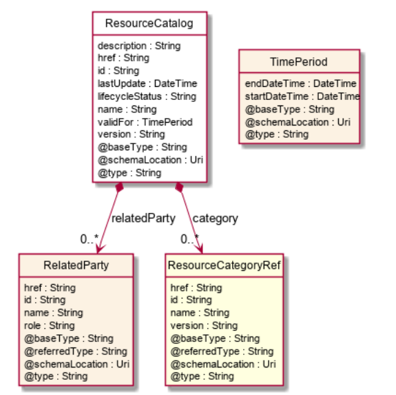

### 3.9.2. Resource Category

The (resource) category resource is used to group resource candidates in
logical containers. Categories can contain other categories.

- **category** A list of resource category references
  (ResourceCategoryRef \[\*\]). The category

- **resource** is used to group product offerings, service and resource
  candidates in logical

- **containers**. Categories can contain other (sub-)categories and/or
  product offerings.

- **description** A string. Description of the category.

- **href** A string. Hyperlink reference to the category.

- **id** A string. Unique identifier of the category.

- **isRoot** A boolean. If true, this Boolean indicates that the
  category is a root of categories.

- **lastUpdate** A date time (DateTime). Date and time of the last
  update.

- **lifecycleStatus** A string. Used to indicate the current lifecycle
  status.

- **name** A string. Name of the category.

- **parentId** A string. Unique identifier of the parent category.

- **relatedParty** A list of related parties (RelatedParty \[\*\]). List
  of parties involved in this category.

- **resourceCandidate** A list of resource candidate references
  (ResourceCandidateRef \[\*\]). List of resource candidates accessible
  via this category.

- **validFor** A time period. The period for which the category is
  valid.

- **version** A string. Category version.

### 3.9.3. Resource Candidate

ResourceCandidate is an entity that makes a resource specification
available to a catalog. A ResourceCandidate and its associated resource
specification may be published - made visible - in any number of
resource catalogs, or in none. A resource candidate exposes a resource
specification in catalogs, establishing that the resource specification
can now be used in offers and instantiated in resources.

- **category** A list of resource category references
  (ResourceCategoryRef \[\*\]). The categories in which this candidate
  is exposed.

- **description** A string. Description of this REST resource.

- **href** A string. Hyperlink reference to this REST resource.

- **id** A string. Unique identifier of this REST resource.

- **lastUpdate** A date time (DateTime). Date and time of the last
  update of this REST resource.

- **lifecycleStatus** A string. Used to indicate the current lifecycle
  status of the resource candidate.

- **name** A string. Name given to this REST resource.

- **resourceSpecification** A resource specification reference
  (ResourceSpecificationRef). The detailed specification for this
  candidate.

- **validFor** A time period. The period for which this REST resource is
  valid.

- **version** A string. the version of resource candidate.

Figure 3.6.3-1 - Resource candidate

### 3.9.4. Resource Specification

Resources are physical or non-physical components (or some combination
of these) within an enterprise’s infrastructure or inventory. They are
typically consumed or used by services (for example a physical port
assigned to a service) or contribute to the realization of a Product
(for example, a SIM card). They can be drawn from the Application,
Computing and Network domains, and include, for example, Network
Elements, software, IT systems,content and information, and technology
components. A ResourceSpecification is an abstract base class for
representing a generic means for implementing a particular type of
Resource. In essence, a ResourceSpecification defines the common
attributes and relationships of a set of related Resources, while
Resource defines a specific instance that is based on a particular
ResourceSpecification

The resource specification model defines the following fields:

- **attachment** A list of attachment ref or values
  (AttachmentRefOrValue \[\*\]). Complements the description of an
  element (for instance a resource) through video, pictures …

- **category** A string. Category of the target resource like
  NetworkConnectivity, PhysicalLinks, Generic, L2Network and so on.

- **description** A string. Description of this REST resource.

- **featureSpecification** A list of feature specifications
  (FeatureSpecification \[\*\]). A list of Features for
  thisspecification.

- **href** A string. Hyperlink reference to this REST resource.

- **id** A string. Unique identifier of this REST resource.

- **isBundle** A boolean. A flag indicates that if this resource
  specification is a bundled

- **specification** (true) or single (false).

- **lastUpdate** A date time (DateTime). Date and time of the last
  update of this REST resource.

- **lifecycleStatus** A string. Used to indicate the current lifecycle
  status of the resource specification.

- **name** A string. Name given to this REST resource.

- **relatedParty** A list of related parties (RelatedParty \[\*\]). A
  related party defines party or party role linked to a specific entity.

- **resourceSpecCharacteristic** A list of resource specification
  characteristics (ResourceSpecificationCharacteristic\[\*\]). A
  characteristic quality or distinctive feature of a
  ResourceSpecification. The characteristic can be take on a discrete
  value, such as color, can take on a range of values, (for example,
  sensitivity of 100-240 mV), or can be derived from a formula (for
  example, usage time (hrs) = 30 - talk time \*3). Certain
  characteristics, such as color, may be configured during the ordering
  or some other process.

- **resourceSpecRelationship** A list of resource specification
  relationships (ResourceSpecificationRelationship\[\*\]). A migration,
  substitution, dependency or exclusivity relationship between/among
  resource specifications.

- **targetResourceSchema** A target resource schema
  (TargetResourceSchema). A target resource schema reference. The
  reference object to the schema and type of target resource which is
  described by resource specification.

- **validFor** A time period. The period for which this REST resource is
  valid.

- **version** A string. Resource Specification version

Figure 3.6.4-1 - Resource specification

## 3.10. TMF652 - Resource Ordering Management

The REST API for Resource Order Management. It includes the model
definition as well as all available operations. Possible actions are
creating, updating and retrieving Resource Orders (including filtering).
A Resource Order API provides a standard mechanism for placing a
Resource Order with all necessary order parameters.

### 3.10.1. Resource Order

A Resource Order is a request to provision a set of Resources (logical
and physical) triggered by the request to provision a Service through a
Service Order

The resource order model has the following fields:

- **cancellationDate**: Date when the order is cancelled - if cancelled,

- **cancellationReason**: Reason why the order is cancelled - if
  cancelled.

- **Category**: Used to categorize the order from a business perspective
  that can be useful for the order management system.

- **completionDate**: Date when the order was actually completed

- **description.** A string. Free-text description of the Resource Order

- **expectedCompletionDate**: Date when the order is expected to be
  completed

- **externalReference**: External reference of the individual or
  reference in another system.

- **name:** A string. A string used to give a name to the Resource
  Order.

- **Note**: A list of notes. Extra information about a given entity.

- **orderDate**: Date when the order was created.

- **orderItem**: An identified part of the order. A resource order is
  decomposed into one or more order items.

  - **Action**: An order item action type (OrderItemActionType). action
    to be performed on the resource.

  - **Appointment**: Refers an appointment, such as a Customer
    presentation or internal meeting or site visit.

  - **Quantity**: Quantity ordered.

  - **resourceSpecification**: A resource specification reference

  - **State**: A resource order item state type. Possible values for the
    state of the order item.

- **orderType**: Name of the Resource Order type.

- **Priority**: A way that can be used by consumers to prioritize orders
  in the OM system (such as: 0 is the highest priority, and 4 the
  lowest).

- **relatedParty**: A related party defines party or party role linked
  to a specific entity

- **requestedCompletionDate**: Requested delivery date from the
  requestor perspective

- **requestedStartDate**: Order start date wished by the requestor

- **startDate**: Date when the order was actually started,

- **State**: Possible values for the state of the order.

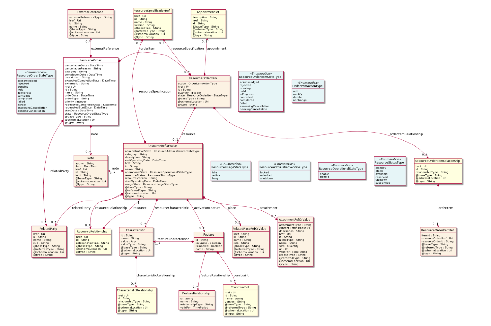

Figure 3.7.1-1 - Resource order

The Resource Ordering Management API defines the following lifecycle for
Resource Orders:

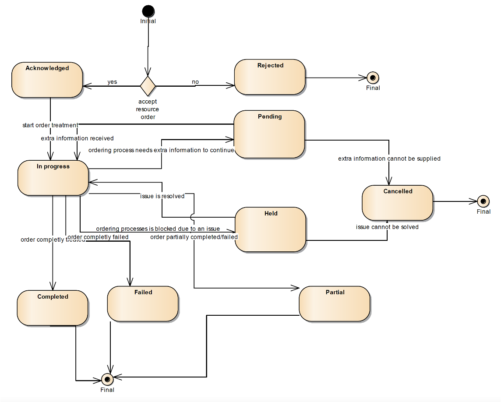

Figure 3.7.1-2 - Resource order lifecycle

## 3.11. TMF639 - Resource Inventory Management

Resource is an abstract entity that describes the common set of
attributes shared by all concrete resources (e.g. TPE, EQUIPMENT) in the
inventory.

### 3.11.1. Resource

The resource model defines the following fields:

- **activationFeature**: Applicable configuration features of a resource
  for activation.

- **administrativeState**: A resource administrative state type. Tracks
  the administrative state of the resource, such as locked, unlocked,
  shutdown and so on.

- **Attachment**: A list of attachment ref or values

- **Category**: Category of the concrete resource. e.g Gold, Silver for
  MSISDN concrete

- resource.

- **startOperatingDate**: The date from which the resource is operating.

- **endOperatingDate**: The date till the resource is operating.

- **operationalState**: Tracks the operational state of the resource,
  such as enable, disable and so on.

- **Place**: A related place defines a place described by reference or
  by value linked to a specific entity.

- **relatedParty**: A related party defines a party or party role linked
  to a specific entity.

- **resourceCharacteristic**: Describes a given characteristic of an
  object or entity through a name/value pair.

- **resourceRelationship**: Linked resources to the one instantiate,
  such as \[bundled\] if the resource is a bundle and you want to
  describe the bundled resources inside this bundle; \[reliesOn\] if the
  resource needs another already owned resource to rely on (e.g. an
  option on an already owned mobile access resource) \[targets\] or
  \[isTargeted\] (depending on the way of expressing the link) for any
  other kind of links that may be useful.

- **resourceSpecification**: The ResourceSpecification is required to
  realize a ProductSpecification

- **resourceStatus**: Tracks the resource status of the resource, such
  as standby, alarm, available, reserved, suspended and so on

- **resourceVersion**: A field that identifies the specific version of
  an instance of a resource.

- **usageState**: Tracks the usage state of the resource, such as idle,
  active, busy and so on.

Figure 3.8.1-1 - Resource

The Resource Inventory API defines the following lifecycle for
Resources:

Figure 3.8.1-2 - Resource lifecycle

## 3.12. TMF664 - Resource Function Activation and Configuration

### 3.12.1. Resource Function

- **value** A string. the value of the logical resource. E.g
  ‘0746712345’ for MSISDN’s.

- **category** A string. Category of the concrete resource. e.g Gold,
  Silver for MSISDN concrete resource.

- **description** A string. free-text description of the resource.

- **endOperatingDate** A date time (DateTime). A date time( DateTime).
  The date till the resource is operating.

- **name** A string. A string used to give a name to the resource.

- **resourceVersion** A string. A field that identifies the specific
  version of an instance of a resource.

- **startOperatingDate** A date time (DateTime). A date time( DateTime).
  The date from which the resource is operating.

- **autoModification** A list of characteristics (Characteristic
  \[\*\]). List of the kinds of automodifications that are applied to a
  given network service e.g what can be scaled.

- **connectionPoint** A list of connection point references
  (ConnectionPointRef \[\*\]). External connection points of the
  resource function. These are the service access points (SAP) where
  inputs and outputs of the function are available.

- **connectivity** A list of resource graphs (ResourceGraph \[\*\]).
  Internal connectivity of contained resource functions.

- **functionType** A string. A type of the Resource Function as
  specified by the provider of the API.

- **priority** An integer. Priority of the Resource Function. Decides
  what happens in a contention scenario.

- **role** A string. Role of the Resource Function. Used when Resource
  Function is a component of a composite Resource Function and the exact
  role of the service within the composite is not clear from
  descriptor/location.

- **schedule** A list of schedule references (ScheduleRef \[\*\]). This
  is a reference to a schedule. Allows consumers to schedule
  modifications to the service at certain times.

- **activationFeature** A list of features (Feature \[\*\]).
  Configuration features.

- **administrativeState** A resource administrative state type
  (ResourceAdministrativeStateType). Tracks the administrative state of
  the resource, such as locked, unlocked, shutdown and so on.

- **attachment** A list of attachment ref or values
  (AttachmentRefOrValue \[\*\]). An attachment by value or by reference.
  An attachment complements the description of an element, for example
  through a document, a video, a picture.

- **note** A list of notes (Note \[\*\]). Extra information about a
  given entity.

- **operationalState** A resource operational state type
  (ResourceOperationalStateType). Tracks the operational state of the
  resource, such as enable, disable and so on.

- **place** A related place ref or value (RelatedPlaceRefOrValue).
  Related Entity reference. A related place defines a place described by
  reference or by value linked to a specific entity. The polymorphic
  attributes @type, @schemaLocation & @referredType are related to the
  place entity and not the RelatedPlaceRefOrValue class itself.

- **relatedParty** A list of related parties (RelatedParty \[\*\]).
  Related Entity reference. A related party defines party or party role
  linked to a specific entity. **resourceCharacteristic** A list of
  characteristics (Characteristic \[\*\]). Describes a given
  characteristic of an object or entity through a name/value pair.

- **resourceRelationship** A list of resource relationships
  (ResourceRelationship \[\*\]). Linked resources to the one
  instantiate, such as \[bundled\] if the resource is a bundle and you
  want to describe the bundled resources inside this bundle;
  \[reliesOn\] if the resource needs another already owned resource to
  rely on (e.g. an option on an already owned mobile access resource)
  \[targets\] or \[isTargeted\] (depending on the way of expressing the
  link) for any other kind of links that may be useful.

- **resourceSpecification** A resource specification reference
  (ResourceSpecificationRef). Resources are physical or non-physical
  components (or some combination of these) within an enterprise’s
  infrastructure or inventory. They are typically consumed or used by
  services (for example a physical port assigned to a service) or
  contribute to the realization of a Product (for example, a SIM card).
  They can be drawn from the Application, Computing and Network domains,
  and include, for example, Network Elements, software, IT systems,
  content and information, and technology components. A
  ResourceSpecification is an abstract base class for representing a
  generic means for implementing a particular type of Resource. In
  essence, a ResourceSpecification defines the common attributes and
  relationships of a set of related Resources, while Resource defines a
  specific instance that is based on a particular ResourceSpecification.

- **resourceStatus** A resource status type (ResourceStatusType). Tracks
  the resource status of the resource, such as standby, alarm,
  available, reserved, suspended and so on.

- **usageState** A resource usage state type (ResourceUsageStateType).
  Tracks the usage state of the resource, such as idle, active, busy and
  so on.

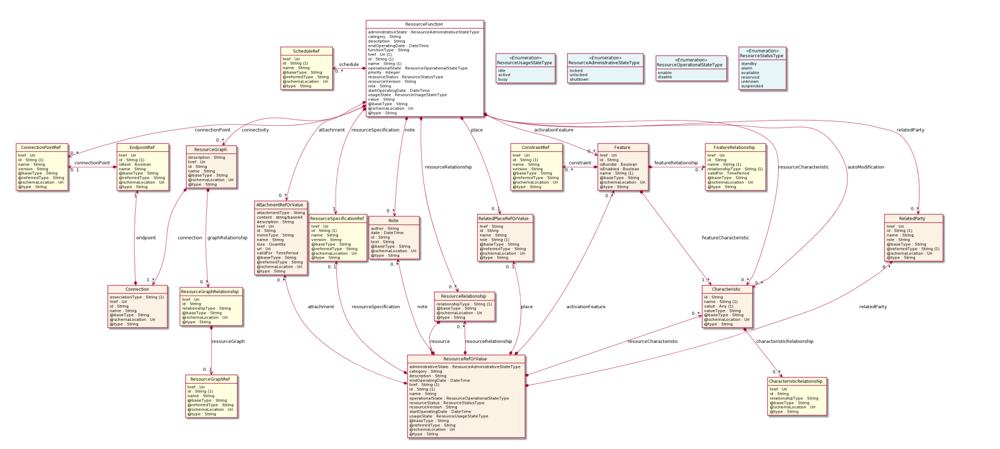

## 3.13. TMF633 - Service Catalog Management

### 3.13.1. Service Catalog

A service catalog is a group of service specifications made available
through service candidates that an organization provides to the
consumers (internal consumers like its employees or B2B customers or B2C
customers). A service catalog typically includes name, description and
time period that is valid for. It will have a list of ServiceCandidate
catalog items. A ServiceCandidate is an entity that makes a
ServiceSpecification available to a catalog. A ServiceCandidate and its
associated ServiceSpecification may be “published” - made visible -in
any number of ServiceCatalogs, or in none.

- **category** A list of service category references (ServiceCategoryRef
  \[\*\]). List of service categories associated with this catalog.

- **description** A string. Description of this catalog.

- **lastUpdate** A date time (DateTime). Date and time of the last
  update.

- **lifecycleStatus** A string. Used to indicate the current lifecycle
  status.

- **name** A string. Name of the service catalog.

- **relatedParty** A list of related parties (RelatedParty \[\*\]). List
  of parties or party roles related to this category.

- **validFor** A time period. The period for which the service catalog
  is valid.

- **version** A string. ServiceCatalog version.

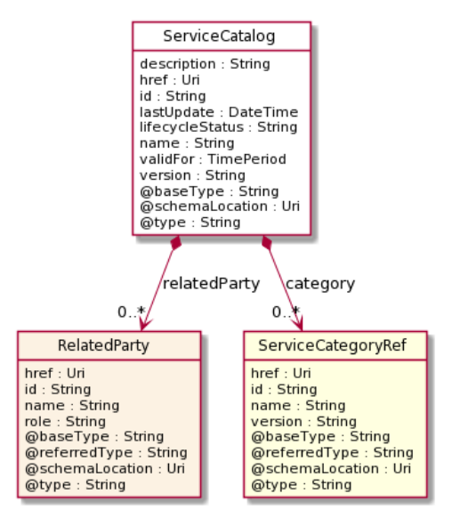

### 3.13.2. Service Category

The (service) category resource is used to group resource candidates in
logical containers. Categories can contain other categories.

- **category** A list of service category references (ServiceCategoryRef
  \[\*\]). List of child categories in the tree for in this category.

- **description** A string. Description of the category.

- **isRoot** A boolean. If true, this Boolean indicates that the
  category is a root of categories.

- **lastUpdate** A date time (DateTime). Date and time of the last
  update.

- **lifecycleStatus** A string. Used to indicate the current lifecycle
  status.

- **name** A string. Name of the category.

- **parentId** A string. Unique identifier of the parent category.

- **serviceCandidate** A list of service candidate references
  (ServiceCandidateRef \[\*\]). List of service candidates associated
  with this category.

- **validFor** A time period. The period for which the category is
  valid.

- **version** A string. ServiceCategory version.

### 3.13.3. Service Candidate

ServiceCandidate is an entity that makes a service specification
available to a catalog. A ServiceCandidate and its associated service
specification may be published - made visible - in any number of service
catalogs, or in none. One service specification can be composed of other
service specifications.

- **description** A string. Description of this REST resource.

- **lastUpdate** A date time (DateTime). Date and time of the last
  update of this REST **resource**.

- **lifecycleStatus** A string. Used to indicate the current lifecycle
  status of the service candidate.

- **name** A string. Name given to this REST resource.

- **serviceSpecification** A service specification reference
  (ServiceSpecificationRef). The service specification

- **implied** by this candidate.

- **validFor** A time period. The period for which this REST resource is
  valid.

- **version** A string. the version of service candidate.

### 3.13.4. Service Specification

ServiceSpecification is a class that offers characteristics to describe
a type of service. Functionally, it acts as a template by which Services
may be instantiated. By sharing the same specification, these services
would therefore share the same set of characteristics.

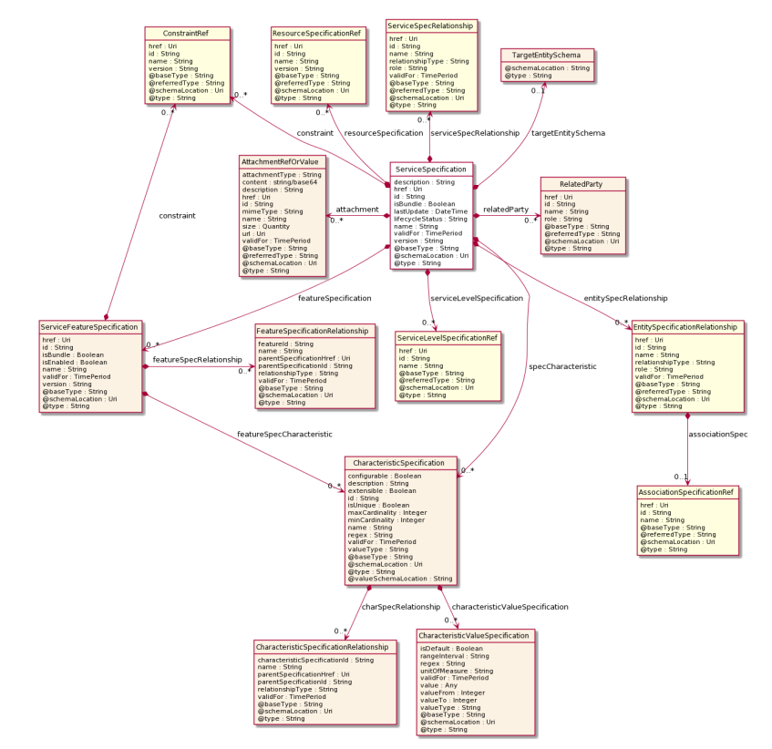

- **description** A string. Description of the specification.

- **isBundle** A boolean. isBundle determines whether specification
  represents a single

- **specification** (false), or a bundle of specifications (true).

- **lastUpdate** A date time (DateTime). Date and time of the last
  update of the specification.

- **lifecycleStatus** A string. Used to indicate the current lifecycle
  status of this catalog item.

- **name** A string. Name given to the specification.

- **version** A string. specification version.

- **featureSpecification** A list of service feature specifications
  (ServiceFeatureSpecification \[\*\]). A list of Features for this
  specification.

- **resourceSpecification** A list of resource specification references
  (ResourceSpecificationRef \[\*\]). A list of

- **resource** specification references (ResourceSpecificationRef
  \[\*\]). The

- **ResourceSpecification** is required for a service specification with
  type

- **ResourceFacingServiceSpecification** (RFSS).

- **serviceLevelSpecification** A list of service level specification
  references (ServiceLevelSpecificationRef \[\*\]). A list of service
  level specifications related to this service specification, and which
  will need to be satisifiable for corresponding service instances; e.g.
  Gold, Platinum.

- **serviceSpecRelationship** A list of service spec relationships
  (ServiceSpecRelationship \[\*\]). A list of service specifications
  related to this specification, e.g. migration, substitution,
  dependency or exclusivity relationship.

- **attachment** A list of attachment ref or values
  (AttachmentRefOrValue \[\*\]). Attachments that may be of relevance to
  this specification, such as picture, document, media.

- **constraint** A list of constraint references (ConstraintRef \[\*\]).
  This is a list of constraint references applied to this specification.

- **entitySpecRelationship** A list of entity specification
  relationships (EntitySpecificationRelationship \[\*\]). Relationship
  to another specification.

- **relatedParty** A list of related parties (RelatedParty \[\*\]).
  Parties who manage or otherwise have an interest in this
  specification.

- **specCharacteristic** A list of characteristic specifications
  (CharacteristicSpecification \[\*\]). List of characteristics that the
  entity can take.

- **targetEntitySchema** A target entity schema (TargetEntitySchema).
  Pointer to a schema that defines the target entity.

- **validFor** A time period. The period for which this REST resource is
  valid.

## 3.14. TMF641 - Service Ordering Management

The REST API for Service Order Management provides a standardized
mechanism for placing a service order with all of the necessary order
parameters. It allows users to create, update & retrieve Service Orders
and manage related notifications.

### 3.14.1. Service Order

The service order model defines the following fields:

- **cancellationDate**: Date when the order is cancelled - if cancelled,

- **cancellationReason**: Reason why the order is cancelled - if
  cancelled.

- **Category**: Used to categorize the order, useful for the OM system,
  such as: Broadband, TVOption.

- **​​errorMessage**: the error(s) cause an order status change

- **completionDate**: Date when the order was actually completed

- **expectedCompletionDate**: Date when the order is expected to be
  completed

- **externalReference**: External reference of the individual or
  reference in another system.

- ​​jeopardyAlert: A list of jeopardy alerts related to this order.

- **Milestone**: A list of milestones related to this order.

- **Note**: A list of notes. Extra information about a given entity.

- **orderDate**: Date when the order was created.

- **serviceOrderItem**: A list of service order items to be processed by
  this order. .The service order item which triggered service
  creation/change/termination.

  - **itemAction**: An order item action type (OrderItemActionType).
    action to be performed on the service.

  - **Role:** role of the service order item for this service.

  - **serviceOrderHref**: Reference of the related entity

  - **serviceOrderId**: Unique identifier of a related entity.

- **Priority**: A way that can be used by consumers to prioritize orders
  in the OM system (such as: 0 is the highest priority, and 4 the
  lowest).

- **relatedParty**: A related party defines party or party role linked
  to a specific entity

- **requestedCompletionDate**: Requested delivery date from the
  requestor perspective

- **requestedStartDate**: Order start date wished by the requestor

- **startDate**: Date when the order was actually started,

- **State**: Possible values for the state of the order.

The Service Ordering
Management API defines the following lifecycle for Service Orders:

Figure 3.11.1-1 - Service order

Figure 3.11.1-2 - Service order lifecycle

## 3.15. TMF638 - Service Inventory Management

### 3.15.1. Service

Service is a base class for defining the Service hierarchy. All Services
are characterized as either being possibly visible and usable by a
Customer or not. This gives rise to the two subclasses of Service:
CustomerFacingService and ResourceFacingService.

The service model includes the following fields:

- **Category**: Is it a customer facing or resource facing service

- **Description**: Free-text description of the service.

- **endDate**: Date when the service ends

- **Feature**: A list of features associated with this service.

- **hasStarted**: If TRUE, this Service has already been started.

- **isBundle**: If true, the service is a ServiceBundle which regroup a
  service hierarchy. If false, the service is an ‘atomic’ service
  (hierarchy leaf).

- **isServiceEnabled**: If FALSE and hasStarted is FALSE, this
  particular Service has NOT been enabled for use - if FALSE and
  hasStarted is TRUE then the service has failed

- **isStateful**: If TRUE, this Service can be changed without affecting
  any other services

- **Name**: Name of the service.

- **Note**: A list of notes made on this service

- **Place**: A list of places. Used to define a place useful for the
  service (for example a geographical place where the service is
  installed).

- **relatedEntity**: A list of related entity in relationship with this
  service

- **relatedParty**: A list of related party references

- **serviceCharacteristic**: A list of characteristics that characterize
  this service

- **serviceDate**: Date when the service was created (whatever its
  status)

- **serviceOrderItem**: A list of service order items related to this
  service. Service Order items that create or modify the current
  service.

- **serviceRelationship**: Describes links with other service(s) in the
  inventory

- **serviceSpecification**: Reference to the specification from which
  this service was instantiated

- **serviceType**: Business type of the service

- **startDate**: Date when the service starts

- **startMode**: This attribute is an enumerated integer that indicates
  how the Service is started, such as: 0: Unknown; 1: Automatically by
  the managed environment; 2: Automatically by the owning device; 3:
  Manually by the Provider of the Service; 4: Manually by a Customer of
  the Provider; 5: Any of the above

- **State**: The life cycle state of the service, such as designed,
  reserved, active, etc…

- **supportingResource**: A list of resource references. A list of
  supporting resources

- **supportingService**: . A collection of services that support this
  service (bundling, link CFS to RFS).

Figure 3.12.1-1 - Service

The Service inventory API defines the following lifecycle for services:

Figure 3.12.1-2 - Service lifecycle

## 3.16. TMF635 - Usage Management

Provides standardized mechanisms for usage management such as creation,
update, retrieval, import and export of a collection of usages. The API
manages both rated and non-rated usage. For example, it allows a service
provider to 1) retrieve usage generated by a partner service platform in
order to rate it and 2) to provide rated usage to a partner for
consumption follow up purposes.

### 3.16.1. Usage

An occurrence of employing a Product, Service, or Resource for its
intended purpose, which is of interest to the business and can have
charges applied to it. It is comprised of characteristics, which
represent attributes of usage.

A usage entity has the following fields:

- **Description**: Description of the usage

- **ratedProductUsage**: A list of rated product usages. An occurrence
  of employing a

- product for its intended purpose with all rating details

  - bucketValueConvertedInAmount

  - **isBilled**: Whether the amount has been billed or not

  - isTaxExempt

  - offerTariffType

  - **productRef**: Reference to the rated product in the Product
    Inventory API.

  - ratingAmountType

  - ratingDate

  - taxExcludedRatingAmount

  - taxIncludedRatingAmount

  - taxRate

  - usageRatingTag

- **relatedParty**: A list of related parties.

- **Status**: Lifecycle status

- **usageCharacteristic**: A list of usage characteristics. Provides the
  value of a given characteristic. This field is used for saving the
  actual usage values.

- **usageDate**: Date of usage.

- **usageSpecification**: Reference to the usage specification.
  UsageSpecification is a detailed description of a usage event that is
  of interest to the business and can have charges applied to it. It is
  comprised of characteristics, which define all attributes known for a
  particular type of usage.

- **usageType**: Type of the usage as defined in its usage
  specification.

Figure 3.13.1-1 - Usage

### 3.16.2. Usage Specification

A detailed description of a usage event that are of interest to the
business and can have charges applied to it. It is comprised of
characteristics, which define all attributes known for a particular type
of usage

The usage specification model includes the following fields:

- **Description**: Description of the specification

- **isBundle**: Determines whether specification represents a single
  specification (false), or a bundle of specifications (true).

- **lastUpdate** A date time (DateTime). Date and time of the last
  update of the specification.

- **lifecycleStatus**: Lifecycle status

- **Name**: Name given to the specification

- **version** A string. specification version.

- **Attachment**: Attachments that may be of relevance to this
  specification, such as picture, document, media

- **Constraint**: A list of constraints references.

- **entitySpecRelationship**: List of entity spec relationships.
  Relationships with other specifications.

- **relatedParty**: List of related parties

- **specCharacteristic**: List of characteristics that the entity can
  take. This field is used to specify what usage metrics should be used
  and placed in the Usage model as usageCharacteristic.

- **targetEntitySchema** A target entity schema (TargetEntitySchema).
  Pointer to a schema that defines the target entity.

- **validFor**: The period for which this REST resource is valid

Figure 3.13.2-1 - Usage specification

## 3.17. TMF632 - Party Management

Provides a standardized mechanism for party management such as creation,
update, retrieval, deletion and notification of events.

Party can be an individual or an organization that has any kind of
relationship with the enterprise.

### 3.17.1. Individual

Individual represents a single human being (a man, woman or child). The
individual can be a customer, an employee or any other person that the
organization needs to store information about.

- **aristocraticTitle**: Baron, Graf, Earl,….

- **birthDate**: DateTime birth date

- **countryOfBirth**: Country where the individual was born.

- **deathDate**: Date of dead, only if the status is Deceased

- **Disability**: List of disabilities. Lack or inadequate strength or
  ability.

- **familyName**: Contains the non-chosen or inherited name. Also known
  as last name in the Western context

- **familyNamePrefix**: Family name prefix.

- **formattedName**: A fully formatted name in one string with all of
  its pieces in their proper place and all of the necessary punctuation.
  Useful for specific contexts (Chinese, Japanese, Korean,…).

- **fullName**: Full name flatten (first, middle, and last names).

- Gender:

- Generation: Sr, Jr, III (the third),….

- **givenName**: First name of the individual

- **individualIdentification**: LIst of individual identifications.
  Represents our registration of information used as proof of identity
  by an individual (passport, national identity card, drivers license,
  social security number, birth certificate).

- **languageAbility**: List of language abilities. Ability of an
  individual to understand or converse in a language.

- **legalName**: Legal name or birth name (name one has for official
  purposes)

- **Location**: Temporary current location of the individual (may be
  used if the individual has approved its sharing).

- **maritalStatus**: Marital status (married, divorced, widow …).

- **middleName**: Middles name or initial.

- Nationality

- **otherName**: List of other names. Keeps track of other names, for
  example the old name of a woman before marriage or an artist name.

- **placeOfBirth**: Reference to the place where the individual was born

- **preferredGivenName**: Contains the chosen name by which the
  individual prefers to be addressed. Note: This name may be a name
  other than a given name, such as a nickname

- **Skill**: LIst of skills. Skills evaluated for an individual with a
  level and possibly with a limited validity when an obsolescence is
  defined (Ex: the first-aid certificate first level is limited to one
  year and an update training is required each year to keep the level).

- **Status**: Lifecycle status of the individual

- **Title**: Pr, Dr, Sir, …

- **contactMedium**: List of contact mediums. Indicates the contact
  medium that could be used to contact the party.

- **creditRating**: A list of party credit profiles. An individual might
  be evaluated for its worthiness and this evaluation might be based on
  a credit rating given by a credit agency.

- **externalReference**: A list of external references. External
  reference of the individual or reference in other system

- **partyCharacteristic**: A list of characteristics. Describes a given
  characteristic of an object or entity through a name/value pair.

- **relatedParty**: A list of related parties. Related Entity reference.
  A related party defines a party or party role linked to a specific
  entity.

- **taxExemptionCertificate**: A list of tax exemption certificates. A
  tax exemption certificate represents a tax exemption granted to a
  party (individual or organization) by a tax jurisdiction which may be
  a city, state, country,… An exemption has a certificate identifier
  (received from the jurisdiction that levied the tax) and a validity
  period. An exemption is per tax types and determines for each type of
  tax what portion of the tax is exempted (partial by percentage or
  complete) via the tax definition.

Figure 3.14.1-1 - Individual

### 3.17.2. Organization

Organization represents a group of people identified by shared interests
or purpose. Examples include business, department and enterprise.
Because of the complex nature of many businesses, both organizations and
organization units are represented by the same data.

- **existsDuring**: A period of time, either as a deadline (endDateTime
  only) a startDateTime only, or both.

- **isHeadOffice**: If value is true, the organization is the head
  office.

- **isLegalEntity**: If value is true, the organization is a legal
  entity known by a national referential.

- **name**: Organization name (department name for example)

- **nameType**: Type of the name : Co, Inc, Ltd,….

- **organizationChildRelationship**: A list of organization child
  relationships. Child references of an organization in a structure of
  organizations.

- **organizationIdentification**: A list of organization
  identifications. Represents our registration of information used as
  proof of identity by an organization

- **organizationParentRelationship**: Parent references of an
  organization in a structure of organizations.

- **organizationType**: Type of Organization (company, department…).

- **otherName**: A list of other name organizations. ). Keeps track of
  other names, for example the old name of an organization.

- **status**: Lifecycle status.

- **tradingName**: Name that the organization (unit) trades under

- **contactMedium**: A list of contact mediums. Indicates the contact
  medium that could be used to contact the party.

- **creditRating**: A list of party credit profiles. An individual might
  be evaluated for its worthiness and this evaluation might be based on
  a credit rating given by a credit agency

- **externalReference**: A list of external references. External
  reference of the organization or reference in other system.

- **partyCharacteristic**: List of characteristics. Describes a given
  characteristic of an object or entity through a name/value pair.

- **relatedParty**: A list of related parties. Related Entity reference.
  A related party defines a party or party role linked to a specific
  entity.

- **taxExemptionCertificate**: A list of tax exemption certificates. A
  tax exemption certificate represents a tax exemption granted to a
  party (individual or organization) by a tax jurisdiction which may be
  a city, state, country,… An exemption has a certificate identifier
  (received from the jurisdiction that levied the tax) and a validity
  period. An exemption is per tax types and determines for each type of
  tax what portion of the tax is exempted (partial by percentage or
  complete) via the tax definition.

Figure 3.14.2-1 - Organization

## 3.18. TMF669 - Party Role Management

A standardized mechanism for general party roles and includes operations
such as creation, update, retrieval, deletion and notification of
events. Notice that for the management of customers there is a specific
Customer Management API.

Party Role management API manages the following data resources:
PartyRole

### 3.18.1. Party Role

The part played by a party in a given context

- **Account**: A list of account references. An account may be a party
  account or a financial account. This field references accounts as
  defined in the Account Management API.

- **Agreement**: List of references to Agreements defined in the
  Agreement Management API. Agreements where the engaged party is
  playing the current party role.

- **Characteristic**: A list of characteristics. Describes the
  characteristics of a party role.

- **contactMedium**: A list of contact mediums. Indicates the contact
  medium that could be used to contact the party.

- **creditProfile**: A list of credit profiles. Credit profile for the
  party (containing credit scoring, …). By default only the current
  credit profile is retrieved. It can be used as a list to give the
  party credit profiles history, the first one in the list will be the
  current one

- **engagedParty**: Reference to the Party owning the role. The party
  who is playing the role.

- **Name**: A word, term, or phrase by which the PartyRole is known and
  distinguished from other PartyRoles

- **paymentMethod**: A list of payment method references. A payment
  method defines a specific means of payment (e.g direct debit).

- **relatedParty**: A list of related parties

- **Status**: LIfecycle status

- **statusReason**: A string providing an explanation on the value of
  the status lifecycle. For instance if the status is Rejected,
  statusReason will provide the reason for rejection.

- **validFor** A time period. The time period that the PartyRole is
  valid for

Figure 3.15.1-1 - Party role

## 3.19. TMF629 - Customer Management

Provides a standardized mechanism for customer and customer account
management, such as creation, update, retrieval, deletion and
notification of events.

### 3.19.1. Customer

- **Account**: A list of account references. An account may be a party
  account or a financial account. This field references accounts as
  defined in the Account Management API.

- **Agreement**: List of references to Agreements defined in the
  Agreement Management API. Agreements where the engaged party is
  playing the current party role.

- **Characteristic**: A list of characteristics. Describes the
  characteristics of a party role.

- **contactMedium**: A list of contact mediums. Indicates the contact
  medium that could be used to contact the party.

- **creditProfile**: A list of credit profiles. Credit profile for the
  party (containing credit scoring, …). By default only the current
  credit profile is retrieved. It can be used as a list to give the
  party credit profiles history, the first one in the list will be the
  current one

- **engagedParty**: Reference to Party. The party who is playing the
  role.

- **name**: A word, term, or phrase by which the PartyRole is known and
  distinguished from other PartyRoles

- **paymentMethod**: A list of payment method references. A payment
  method defines a specific means of payment (e.g direct debit).

- **relatedParty**: A list of related parties

- **Status**: LIfecycle status

- **statusReason**: A string providing an explanation on the value of
  the status lifecycle. For instance if the status is Rejected,
  statusReason will provide the reason for rejection.

- **validFor** A time period. The time period that the Customer is valid
  for.

## 3.20. TMF666 - Account Management

The [<u>Account Management
API</u>](https://tmf-open-api-table-documents.s3.eu-west-1.amazonaws.com/OpenApiTable/TMF666_Account/4.0.0/user_guides/TMF666_Account_Management_API_v4.0.0_specification.pdf)
provides standardized mechanism for the management of billing and
settlement accounts, as well as for financial accounting (account
receivable) either in B2B or B2B2C contexts.

### 3.20.1. Billing Account

A party account used for billing purposes. It includes a description of
the bill structure (frequency, presentation media, format and so on).

The Billing Account lifecycle is tracked by the ‘state’ attribute.

Typical lifecycle values are: Defined, Active, Suspended, pending
Update, pending Closed, Closed.

- **paymentStatus**: The condition of the account, such as due, paid, in
  arrears

- **accountType**: A categorization of an account, such as individual,
  joint, and so forth, whose instances share some of the same
  characteristics. Note: for flexibility we use a String here but an
  implementation may use an enumeration with a limited list of valid
  values.

- **Description**: Detailed description of the party account.

- **Name**: Name of the account.

- **State**: Contains the lifecycle state such as: Active, Closed,
  Suspended and so on.

- **billStructure**: The structure of the bill for party accounts
  (billing or settlement)

- **defaultPaymentMethod**: Payment method to be used by default

- **financialAccount**: Reference to a financial account.

- **paymentPlan**: Defines a plan for payment (when a party wants to
  spread his payments)

- **accountBalance**: List of account balances. Balances linked to the
  account

- **accountRelationship**: List of references to accounts. Significant
  connection between accounts. For instance an aggregating account for a
  list of shop branches each having its own billing account

- **Contact**: A list of contacts. An individual or an organization used
  as a contact point for a given account and accessed via some contact
  medium.

- **creditLimit**: The maximum amount of money that may be charged on an
  account.

- **ratingType**: Indicates whether the account follows a specific
  payment option such as prepaid or postpaid

- **relatedParty**: List of references to related parties

- **taxExemption**: List of tax exemptions. Proof of freedom from taxes
  imposed by a taxing jurisdiction.

Figure 3.17.1-1 - Billing account

### 3.20.2. Settlement Account

A party account used for settlement purposes. It includes a description
of the bill structure (frequency, presentation media, format and so on)

- **description** A string. Detailed description of the party account.

- **lastModified** A date time (DateTime). Date of last modification of
  the account.

- **name** A string. Name of the account.

- **state** A string. Contains the lifecycle state such as: Active,
  Closed, Suspended and so on.

- **billStructure** A bill structure (BillStructure). The structure of
  the bill for party accounts

- (billing or settlement).

- **defaultPaymentMethod** A payment method reference
  (PaymentMethodRef). A payment method defines a specific mean of
  payment (e.g. direct debit).

- **financialAccount** A financial account reference
  (FinancialAccountRef). AccountReceivable

- **reference**. An account of money owed by a party to another entity
  in exchange for goods or services that have been delivered or used. An
  account receivable aggregates the amounts of one or more party
  accounts (billing or settlement) owned by a given party.

- **paymentPlan** A list of payment plans (PaymentPlan \[\*\]). Defines
  a plan for payment (when a party wants to spread his payments).

- **accountBalance** A list of account balances (AccountBalance \[\*\]).
  Balances linked to the account.

- **accountRelationship** A list of account relationships
  (AccountRelationship \[\*\]). Significant connection between accounts.
  For instance, an aggregating account for a list of shop branches each
  having its own billing account.

- **contact** A list of contacts (Contact \[\*\]). An individual or an
  organization used as a contact point for a given account and accessed
  via some contact medium.

- **creditLimit** A money (Money). The maximum amount of money that may
  be charged on an account.

- **relatedParty** A list of related parties (RelatedParty \[\*\]).
  Related Entity reference. A related party defines party or party role
  linked to a specific entity.

- **taxExemption** A list of account tax exemptions (AccountTaxExemption
  \[\*\]). Proof of freedom from taxes imposed by a taxing jurisdiction.

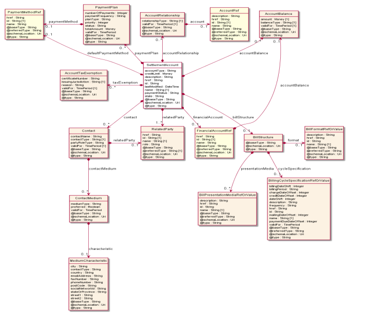

### 3.20.3. Financial Account

An account of money owed by a party to another entity in exchange for
goods or services that have been delivered or used. A financial (account
receivable account/account payable) aggregates the amounts of one or
more party accounts (billing or settlement) owned by a given party

- **accountType** A string. A categorization of an account, such as
  individual, joint, and so forth, whose instances share some of the
  same characteristics. Note: for flexibility we use a String here but
  an implementation may use an enumeration with a limited list of valid
  values.

- **description** A string. Detailed description of the party account.

- **lastModified** A date time (DateTime). Date of last modification of
  the account.

- **name** A string. Name of the account.

- **state** A string. Contains the lifecycle state such as: Active,
  Closed, Suspended and so on.

- **accountBalance** A list of account balances (AccountBalance \[\*\]).
  Balances linked to the account.

- **accountRelationship** A list of account relationships
  (AccountRelationship \[\*\]). Significant connection between accounts.
  For instance, an aggregating account for a list of shop branches each
  having its own billing account.

- **contact** A list of contacts (Contact \[\*\]). An individual or an
  organization used as a contact point for a given account and accessed
  via some contact medium.

- **creditLimit** A money (Money). The maximum amount of money that may
  be charged on an account.

- **relatedParty** A list of related parties (RelatedParty \[\*\]).
  Related Entity reference. A related party defines party or party role
  linked to a specific entity.

- **taxExemption** A list of account tax exemptions (AccountTaxExemption
  \[\*\]). Proof of freedom from taxes imposed by a taxing jurisdiction.

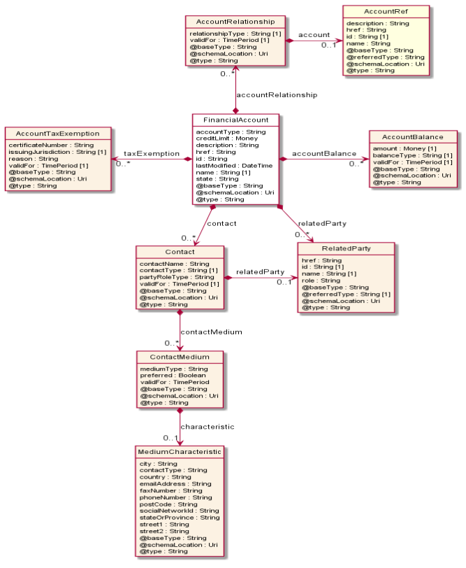
